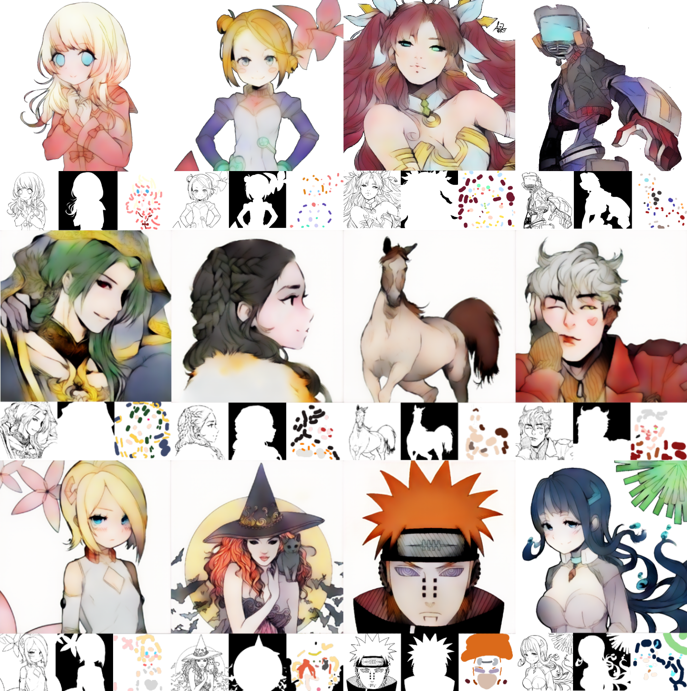
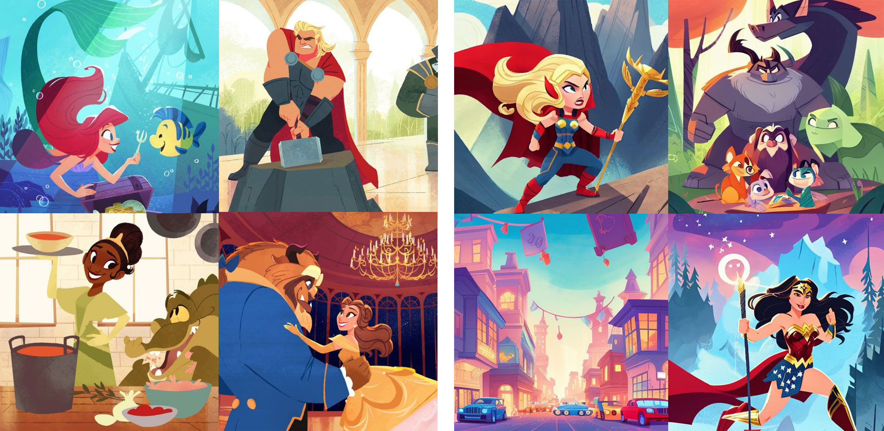

\newpage{}
## List of Abbreviations {-}
::: {#acronyms}
:::

## Abstract {-}
\newpage{}

## Aknowledgements {-}
\newpage{}

<!-- ===================== [START] PART INTRODUCTION ===================== -->
# Introduction {#sec:I}

Humans can perceive and understand the world. We can accomplish a wide range of complex tasks through the combination of visual recognition, scene understanding, and communication. The ability to quickly and accurately extract information from a single image is a testament to the complexity and sophistication of the human brain and is often taken for granted. One objective of the +ai field's is to empower machines with such human-like abilities, one of them being creativity, being able to produce something original and worthwhile [@mumford_2012].

Computational creativity is a multidisciplinary field -- +ai, cognitive psychology, philosophy, and art -- that seeks to understand, simulate, replicate, or enhance human creativity. One definition of creativity [@newell_1959] is the ability to produce something that is novel and useful, demands that we reject common beliefs, results from intense motivation and persistence, or comes from clarifying a vague problem. Top-down approaches to this definition use a mix of explicit formulations of recipes and randomness such as procedural generation. On the opposite, bottom-up approaches use [+ann]{.plural} to learn patterns and heuristics from large datasets to enable non-linear generation.

We are currently witnessing the beginning of a new era where the gap between machines and humans is starting to blur. Recent breakthroughs in the field of +ai, more specifically in +dl, are giving computers the ability to perceive and understand our world, but also to interact with our environment using natural interactions such as speech and natural language. [+ann]{.plural}, once mocked by the +ai community [@lecun_2019], are now trainable using +gd [@rumelhart_1986] thanks to the massive availability of data and the processing power of modern hardware accelerators such as [+gpu]{.plural}, [+tpu]{.plural}, and [+npu]{.plural}.

[+nn]{.plural}, those trainable general function approximators, gave rise to the field of generative [+nn]{.plural}. Specialized +dl architectures such as [+vae]{.plural} [@kingma_2013], [+gan]{.plural} [@goodfellow_2014], [+ddm]{.plural} [@ho_2020], and [+llm]{.plural} [@vaswani_2017; @brown_2020] are used to generate creative artifacts such as text, audio, images, and videos of unprecedented quality and complexity.

This dissertation aims at exploring how one could train and use generative [+nn]{.plurak} to create +ai-powered tools capable of enhancing human creative expression. The task of automatic lineart colorization is chosen to to illustrate this process throughout the entire dissertation. 

## Motivations {#sec:I.1}

{#fig:steps}

Lineart colorization is an essential aspect of the work of artists, illustrators, and animators. The task of manually coloring lineart can be time-consuming, repetitive, and exhausting, particularly in the animation industry, where every frame of an animated product must be colored and shaded. This process is typically done using image editing softwares such as Photoshop [@photoshop], Clip Studio PAINT [@clipstudiopaint], and PaintMan [@paintman]. Automating the colorization process can greatly improve the workflow of these creative professionals and has the potential to lower the barrier for newcomers and amateurs. Such a system was previously integrated into Clip Studio PAINT [@clipstudiopaint] and then removed for ethical and right ownership concerns, demonstrating the growing significance of automatic colorization in the field.

The most common digital illustration process can be broken down into four distinct stages: sketching, inking, coloring, and post-processing (see @fig:steps). As demonstrated by the work of Kandinsky [@kandinsky_1977], the colorization process can greatly impact the overall meaning of a piece of art through the introduction of various color schemes, shading, and textures. These elements of the coloring process present significant challenges for the +cv task of automatic lineart colorization, particularly in comparison to its grayscale counterpart [@furusawa_2O17; @hensman_2017; @zhang_richard_2017]. Without the added semantic information provided by textures and shadows, inferring materials and 3D shapes trhough lighting from black and white linearts only is difficult.

## Problem Statement {#sec:I.2}

One major challenge of automatic lineart colorization is the availability of qualitative public datasets. Illustrations do not always come with their corresponding lineart. The few datasets available for the task are lacking consistency in the quality of the illustrations, gathering images from different types, mediums and styles. For those reasons, online scrapping and synthetic lineart extraction is the method of choice for many of the contributions in the field [@ci_2018; @zhang_richard_2017].

Previous works in automatic lineart colorization are based on the +gan [@goodfellow_2014] architecture and can generate unperfect but high-quality illustrations in a realtime settings. User control and guidance can be achieved by the use of: color hints [@frans_2017; @liu_2017; @sangkloy_2016; @paintschainer_2018; @ci_2018], style transfer [@zhang_ji_2017], tagging [@kim_2019], and more recently natural language [@ho_2020].

Related work compensate for the lack of semantic descriptors provided by the black and white lineart by introducing the use of an external featuree extractor, one of the most common being Illustration2Vec [@saito_2015]. The generative model output process is conditionned on a latent semantic vector capturing the nature of the lineart content.

## Contributions {#sec:I.3}

This thesis contributions focuses on the use of color hints in the form of user strokes as it fits the natural digital artist workflow and does not involve learning and mastering a new skills. While previous works offers improving quality compared to classical +cv techniques, they are still subject to noisy training data, artifacts, lack of variety, and lack of fidelity in the user intent.

In this dissertation we explore the importance of a clean, qualitative and consistent dataset. We investigate how to better capture the user intent via natural artistic controls and how to reflect them into the generated model artifact while preserving or improving its quality. We also look at how the creative process can be transformed into a dynamic iterative workflow where the user collaborates with the machine to refine and carry out variations of his artwork.

Here is a brief enumeration of this thesis's contributions:

- A recipe for generating clean datasets for the task of automatic lineart colorization [@hati_2019; @hati_2023]
- Three following +DL approches to the task of automatic lineart colorization improving upon previous work:
    - PaintsTorch [@hati_2019]: a double GAN generator that improves generation quality compared to previous work while allowing realtime interaction with the end user.
    - StencilTorch [@hati_2023]: an upgrade of PaintsTorch, shifting the colorization problem to in-painting with masks allowing for human-machine collaboration to emerge as a natural workflow where the input of a first pass becomes a potential input for a second.
    - StablePaint: an ongoing exploration of +ddm, bringing more variety into the generated outputs while natively conserving the iterative workflow introduced by StencilTorch at the cost of inference speed.
- An advised reflection on current generative +ai ethical and societal concerns.

## Concerns {#sec:I.4}

Recent advances in generative +ai for text, image, audio, and video synthesis are raising important ethical and societal concerns, especially because of theri availability and ease of use. Models such as Stable Diffusion [@rombach_2021] and more recently Chat-GPT [@openai_2023] are disturbing our common beliefs and relation with copyright, creativity, fake information and so on.

One of the main issues with generative AI is the potential for model fabulation. Generative models can create entirely new, synthetic data that is indistinguishable from real data. This can lead to the dissemination of false information and the manipulation of public opinion. Additionally, there are ambiguities surrounding the ownership and copyright of the generated content, as it is unclear who holds the rights to the generated images and videos. Training data is often obtained via online scrapping and thus copyright ownership is not propagated. This is especially true for commercial applications.

Another important concern is the potential for biases and discrimination. These models are trained on large amounts of data, and if the data is not diverse or representative enough, the model may perpetuate or even amplify existing biases. The Microsoft Tay Twitter bot [@wolf_2017] scandal is an outcome of such a phenomenon. This initially innocent chatbot has been easily turned into a racist bot perpetuating hate speech. The task was made easier because of the inherently biased dataset it was trained on.

In this work, we are committed to addressing and raising awareness for these concerns. The illustrations used for training our models and for our experiments are only used for educational and research purposes. We only provide recipes for reproducibility and do not distribute the dataset nor the weights resulting from model training, only the code. We hope this will not ensure that our work is used ethically and responsibly but limit its potential misuse.

## Outline {#sec:I.5}

This thesis is organized as follows:

- [Chapter 1](#sec:I) introduces the topic of automatic lineat colorization, providing motivation for this work, the probleme statement, the contributions of this thesis, and the concerns it may raise.
- [Chapter 2](#sec:II) provides a theoritocal background on +ML and +ANNN which are the foundations of the methods proposed in this dissertation.
- [Chapter 3](#sec:III) reviews the related work on automatic lineart colorization, both classical, and +NN approches.
- [Chapter 4](#sec:IV) presents the contributions of this thesis, including the development of three new methods for automatic lineart colorization: [PaintsTorch](#sec:IV.2) [@hati_2019], [StencilTorch](#sec:IV.3) [@hati_2023], and an ongoing work, [StablePaint](#sec:IV.4).
- [Chapter 5](#sec:V) concludes the thesis and discusses the remaining challenges, future work and concerns of the this work on automatic lineart colorization.

The code base for the experiments and contributions is publicly available on GitHub at [https://github.com/yliess86](https://github.com/yliess86).

\newpage{}
<!-- ===================== [END] PART INTRODUCTION ===================== -->

<!-- ===================== [START] PART BACKGROUND ===================== -->
# Theoretical Background {#sec:II}

This chapter provides a theoritocal background on [+ml]{.full} and [+ann]{.full} which are the foundations of the methods proposed in this dissertation. [Section 1](#sec:II.1) introduces some of the +ml first principles, and [Section 2](#sec:II.2) presents +ann fundamental concepts from the early Perceptron to the modern Transformers. A more detailed and complete introduction to the field can be found in "the Deep Learning book" by Ian Goodfellow et al [@goodfellow_2016] or in "Dive into Deep Learning" by Aston Zhang et al. [@aston_zhang_2021].

## Machine Learning {#sec:II.1}

[+ml]{.full} is a branch of +ai that studies how computers can learn how to solve a task without being explicitly programmed to do it. +ml algorithms are trained on data using probabilistic modeling, statistical inference, and linear algebra, to identify patterns in the data. These patterns can then be used for prediction and decision making.

In this section, we provide a theoretical overview of +ml, with a focus on supervised learning, optimization, and backpropagation. These concepts are essential to the understanding of the methods presented in this thesis.

### Supervised Learning {#sec:II.1.1}

In +ml, problems are often expressed as data-driven learning tasks, where a computer is used to find a mapping $f: X \rightarrow Y$ from input space $X$ to output space $Y$. For example, $X$ could represent data about an e-mail and $Y$ the probability of this e-mail being a spam. In practice, manually defining all the characteristics of a function $f$ that would satisfy this task is considered unpractical. It would require one to manually describe all potential rules defining spam.

In +ml, the supervised framework offers a practical solution consisting of acquiring labeled data pairs, $(x, y) \in X \times Y$ for the current problem (see @fig:dataflow). In our case, this would require gathering a dataset of e-mails and asking humans to label those as spam or not.

{#fig:dataflow}

**Objective Function**: Let us consider such a training dataset containing n independent pairs $\{(x_1, y_1), \dots, (x_n, y_n)\}$ sampled from the data distribution $D$, $(x_i, y_i) \sim D$. In +ml, we seek for learning a mapping $f: X \rightarrow Y$ by searching the space of the candidates function class $\mathcal{F}$. Defining a scalar objective function $L(\hat{y}, y)$ measuring the distance from true label $y$ and our prediction $f(x_i) = \hat{y}_i$ given $f \in \mathcal{F}$, the ultimate objective is to find the function $f^* \in F$ that best satisfies the following minimization problem (see @eq:f_star_objective):

$$
f^* = arg \; \underset{f \in \mathcal{F}}{min} \; E_{(x, y) \sim D} L(\hat{y}, y)
$$ {#eq:f_star_objective}

The function $f^*$ must minimize the expected loss $L$ over the entire data distribution $D$. Once such a function is learned one can use it to perform inference and map any element from the input space $X$ to the output space $Y$.

However, this minimization problem is intractable as it is impossible to represent the entire distribution $D$. Fortunately, as every pair $(x_i, y_i)$ is independently sampled and identically distributed, the objective can be approximated by sampling and minimizing the loss over the training dataset (see @eq:f_star_objective_approx):

$$
f^* \approx arg \; \underset{f \in \mathcal{F}}{min} \; \frac{1}{n} \sum_{i=1}^{n} L(\hat{y}_i, y_i)
$$ {#eq:f_star_objective_approx}

**Regularization**: While simplifying the problem allows us to perform loss minimization, this approximation comes at a cost. This optimization problem can have multiple solutions, a set of functions $\{f_1, \dots, f_m\} \in F$ performing well on the given training set, but would behave differently outside of the training data and outside of the data distribution. Those functions would not necessarily be able to generalize.

To mitigate those concerns, we can introduce a regularization term $R$ into the objective function (see @eq:f_star_objective_regul), a scalar function that is independent of the data distribution and represent a preference on certain function classes.

$$
f^* \approx arg \; \underset{f \in \mathcal{F}}{min} \; \frac{1}{n} \sum_{i=1}^{n} L(\hat{y}_i, y_i) + R(f)
$$ {#eq:f_star_objective_regul}

In the following, we investigate two examples where supervised learning is first applied to a regression problem, and then a classification problem. The examples highlight the objective functions composed by the loss and the regularization term for regression and classification respectively.

**Regression Problem:** Let us consider the distribution $D$ represented by the $sin$ function in the $[-3 \pi; 3 \pi]$ range (see @fig:regression). We sample $50$ pairs $(x_i, y_i)$ with $X \in [-3 \pi; 3 \pi]$  and $Y \in [-1; 1]$. Our objective is to learn a regressor $f_\theta$, a three layers +nn parametrized by its weights $\{w_0, W_1, w_2\} = \theta$. $w_0$ contains $(1 \times 16) + 1$ weights, $W_1$, $(16 \times 16) + 1$, and $w_2$, $(16 \times 1) + 1$. In this case, the function space is limited to the three layers +nn family with $291$ parameters $\mathcal{F}$.

![[+nn]{.full} regression example. The model $f_\theta$ is fit on the training set $(X, Y) \in D$ representing the $sin$ function in the range $[-3 \pi; 3 \pi]$.](./figures/core_nn_regression.svg){#fig:regression}

To achieve this goal using supervised learning, we can optimize the following objective function (see @eq:reg_sin_objective): 

$$
f^* = arg \; \underset{\theta}{min} \; \frac{1}{n} \sum_{i=1}^{n} (f_\theta(x_i) - y_i)^2 + \lambda ||\theta||_2^2
$$ {#eq:reg_sin_objective}

where the loss is the +mse $||.||_2^2$ between the ground-truth $y_i$ and the prediction $\hat{y_i} = f_\theta(x_i)$. The weighted regularization term $\lambda ||\theta||_2^2$ is used to penalize the model for having large weights and favor a simpler solution.

**Classification Problem:** Let us consider the distribution $D$ representing the 2d positions of two clusters ${0, 1} \in K$ of moons (see @fig:classification). We sample $250$ moon $(x_i, y_i)$ with $X \in [-1; 1]$  and $Y \in [-1; 1]$. Our objective is to learn a classifier $f_\theta$, a three layers +nn parametrized by its weights $\{w_0, W_1, w_2\} = \theta$. $w_0$ contains $(1 \times 32) + 1$ weights, $W_1$, $(32 \times 32) + 1$, and $w_2$, $(32 \times 1) + 1$. In this case, the function space is limited to the three layers +nn family with $1,091$ parameters $\mathcal{F}$.

![[+nn]{.full} classification example. The model $f_\theta$ is trained to classify moons based on their positions. The decision boundary is shown.](./figures/core_nn_classification.svg){#fig:classification}

To achieve this goal using supervised learning, we can optimize an objective function similar to the regression problem (see @eq:reg_sin_objective) using the cross-entropy as the loss function (see @eq:cross_entropy), measuring the classification discordance.

$$
\mathcal{L} (\hat{y}, y) = \sum_{k=1}^{K} y_k \; log \; \hat{y}_k
$$ {#eq:cross_entropy}

### Optimization {#sec:II.1.2}

In +ml, supervised problems can be reduced to an optimization problem where the computer has to find a set of parameters, weights $\theta$, for a given function class $\mathcal{F}$ by optimizing an objective function $\theta^* = arg \; min_\theta \mathcal{C(\theta)}$ made out of two components, a data-dependant loss $L$ and a data-independant regularization $R$.

**Random Search:** One way to find such a function $f_\theta$ that satisfies this objective is to estimate the objective function for a set of random parameter initializations and take the one that minimizes $C$ the most. This $\theta$ setting can then be refined by applying random perturbations to the parameters and repeating the operation.

This is possible due to the fact that we can compute $C(\theta)$ for any value of $\theta$ taking the average loss for a given dataset. However, such an approach to optimization is unpractical. [+nn]{.plural} often come with millions or billions parameters $\theta$ making random-search intractable.

**First Order Derivation:** A more efficient approach is to make the objective function $C$ and the model $f_\theta$ differentiable. This constraint allows us to compute the gradient of the cost $C$ with respect to the model's parameters $\theta$. The value $\nabla_\theta C$ can be obtained using backpropagation (discussed in the next sub-section @sec:II.1.3).

This vector of first order derivatives indicates the direction from which we need to move the weights $\theta$ away. By taking small iterative steps toward the negative direction of the gradients, we can improve $\theta$. This algorithm is called +gd. In practice, due to the very large size of the datasets ($14,197,122$ images for ImageNet [@deng_2009]), the objective gradient is approximated using a small subset of the training data for each step referred to as a minibatch. This approximation of the +gd is called +sgd.

One critical aspect of the +sgd algorithm is the hyperparameter $\epsilon$, the learning rate. It controls the size of the step we take towards the negative gradients. If it is too high or too low, the optimization may not converge towards an acceptable local minimum. A toy example is provided in @fig:toysgd where different learning rates are used to find the minimum of the square function $y = x^2$.

![Toy example where different learning rates $\epsilon$ are used to find the minimum of the square function $y = x^2$ using the [+gd]{.full} algorithm starting from $x = -1$. Some learning rate setup result in situations where the optimization does not converge to the solution. A learning rate $\epsilon = 2$ diverges toward infinity, $\epsilon = 1$ is stuck and bounces between two positions $-1$ and $1$. However, a small learning rate $\epsilon = 0.1 < 1$ converges towards the minimum $y = 0$. This example illustrates the impact of the hyperparameter $\epsilon$ on +gd.](./figures/core_nn_sgd.svg){#fig:toysgd}

**First Order Derivation with Momentum:** The +dl literature contains abundant work on first order optimizer variants aiming for faster convergence such as +sgd with Momentum [@qian_1999],  Adagrad [@duchi_2011], RMSProp [@hinton_lecture6a], Adam [@kingma_2014], and its correction AdamW [@loshchilov_2017]. A toy example is shown @fig:sgd_moments.

{#fig:sgd_moments}

The Momentum update [@qian_1999] introduces the use of a momentum inspired by physics' first principles to favor small and consistent gradient directions. In this particular case, the momentum is represented by a variable $v$ updated to store an exponential decaying sum of the previous gradients $v := \alpha v + \nabla_\theta C(\theta)$. The weights are then updated using negative $v$ as the gradient direction instead of $\nabla_\theta C(\theta)$.

Other optimizers also make use of the second moment of the gradients. Adagrad [@duchi_2011] uses another variable $r$ to store the second moment $r := r + \nabla_\theta C(\theta) \odot \nabla_\theta C(\theta)$ and modulate the update rule toward the negative direction $\frac{1}{\delta + \sqrt{r}} \odot \nabla_\theta C(\theta)$ where $\delta$ is a small value to avoid division by zero. Similarly, RMSProp [@hinton_lecture6a] maintains a running mean of the second moment $r := \rho r + (1 - \rho) \nabla_\theta C(\theta) \odot \nabla_\theta C(\theta)$.

Finally Adam [@kingma_2014], and its correction AdamW [@loshchilov_2017], are applying both Momentum and RMSProp estimating the first and second moment to make parameters with large gradients take small steps and parameters with low gradients take larger ones. This has the advantage to allow for bigger learning rates and faster convergence at the cost of triple the amount of parameters to store during training.

**Cross-Validation and HyperParameter Search:** As illustrated by the toy examples (see [@fig:toysgd; @fig:sgd_moments]), the training of [+nn]{.plural} using +sgd is highly dependent on the initial setting of hyperparameters. One could ask if there is a rule for choosing such parameters. Unfortunately, this is not the case. The field is highly empirical and driven by exploration using the scientific method.

One common approach is to set up metrics to evaluate the performance of the model during the optimization process. It is a good practice to divide the dataset into validation folds that are different from the training data to evaluate the generalization capabilities of the model. This practice is referred to as $k$-fold cross-validation and is most of the time in +dl, because of the large datasets, reduced to a single fold, called the validation set.

By defining such a process, [+nn]{.plural} can be compared in a controlled manner and the hyperparameter space can be searched. Hyperparameter search is so important that it is a subfield of its own. The broad +dl literature however contains many examples of initial parameters and architectures that can be used to bootstrap this search.

### Backpropagation {#sec:II.1.3}

In the previous sub-section (see @sec:II.1.2), we saw how to learn parametrized functions $f_\theta$ given a training dataset. By evaluating the gradients of the objective function with respect to the model's parameters, it is possible to obtain a good enough mapping $f_\theta: X \rightarrow Y$. In this sub-section, we discuss backpropagation, the recursive algorithm used to efficiently compute those gradients exploiting the chain rule $\frac{\partial z}{\partial x} = \frac{\partial z}{\partial y} \cdot \frac{\partial y}{\partial x}$ with $z$ dependant on $y$ and $y$ on $x$.

**Automatic Differentiation:** In mathematics, +ad describes the set of techniques used to evaluate the derivative of a function and exploits the fact that any complex computation can be transformed into a sequence of elementary operations and functions with known symbolic derivatives. By applying the chain rule recursively to this sequence of operations, one can automatically compute the derivatives with precision at the cost of storage. We distinguish two modes of operation for +ad: forward mode differentiation, and reverse mode differentiation.

In forward mode, the derivatives are computed after applying each elementary operation and function in order using the chain rule. It requires storing the gradients along the way and carrying them until the last computation. This mode is preferred when the size of the outputs exceeds the size of the inputs. This is generally not the case for [+nn]{.plural} where the input, an image for example, is larger than the output, a scalar for the objective function.

On the opposite, reverse mode differentiation traverses the sequence of operations from end to start using the chain rule and requires storing the output of the operations instead. This method is preferred when the size of the inputs exceeds the outputs. This mode thus requires two passes, a forward pass where one computes the output of every operation in their order of appearance, and a backward pass, where the sequence of operations is traversed in backward order to compute the derivatives (see figure @fig:dag).

![Illustration of reverse mode [+ad]{.full}. This [+dag]{.full} shows the forward pass in green and backward pass in red. The gradient of an activation is computed by multiplying the local gradient of a node by its output gradient computed in the previous step when following backward differentiation $\frac{\partial C}{\partial x} = \frac{\partial z}{\partial x} \cdot \frac{\partial C}{\partial z}$ where $\frac{\partial z}{\partial x}$ is the location derivative and $\frac{\partial C}{\partial z}$ the output one.](./figures/core_nn_dag.svg){#fig:dag}

**Computation Graph:** A +nn can be defined as a succession of linear transformations followed by non-linear activations (discussed in the next section [@sec:II.2]). Those elementary operations are differentiable and when thinking of the data flow can be viewed as a computation +dag to which backpropagation, reverse mode differentiation, can be applied.

In modern +dl frameworks [@pytorch; @tensorflow], the +ad is centered on the implementation of a Graph object with Nodes. Both entities possess a `forward()` and a `backward()` function. The forward pass calls the `forward()` function of each node of the graph by traversing it in order while saving the node output for differentiation. The backward pass traverses the graph recursively in backward order calling the `backward()` function responsible for computing the local gradient of the node operation and multiplying it by its output gradient following the chain rule. Nodes are in most frameworks referred to as Layers, the elementary building block of the +nn operation chain.

Fortunatly open-source implementations of such engines are already available and extensively used by the +dl community. They have the adantage to work at the Tensor level, and offer support for accelerated hardware such as [+gpu]{.full .plural}, [+tpu]{.full .plural}, and [+npu]{.full .plural}. In this dissertation, we are using the PyTorch [@pytorch] framework, a Python Tensor library written in C++ and equipped with a powerful eager mode reverse +ad engine.  

**Eager or Graph Execution:** Modern +dl frameworks such as PyTorch [@pytorch] and Tensorflow [@tensorflow] now propose two execution modes. An eager mode, where the graph is built dynamically and operations are applied immediately, and a graph mode where the computational graph has to be defined beforehand.

Both modes come with advantages and inconveniences. Eager mode is useful for iterative development and provides an intuitive interface similar to imperative programming, it is easier to debug and offers natural control flows as well as hardware acceleration support. On the other side, graph mode allows for more efficient execution. The graph can be optimized by applying operations similar to the ones used in programming language [+ast]{.plural}. Graph edges can be merged into a single fused operation, and execution can be optimized for parallelization. It is often the preferred way for deployment where the execution time and memory are at stake.

## Artificial Neural Networks {#sec:II.2}

In the previous section (Section @sec:II.1), we described the general setup for +ml, where one has to fit a model from a given function family $f \in \mathcal{F}$ on a given dataset $(X, Y) \in D$ optimized using +sdg and backpropagation. This section introduces a particular class of parameterized function $f_\theta$ called [+nn]{.full .plural}. The section starts with the most simple +nn architecture, the Perceptron, and ends with a more recent and complex architecture, the Transformer.

### Perceptron {#sec:II.2.1}

{#fig:perceptron width=40%}

The Perceptron, introduced by Frank Rosenblatt in 1958 [@rosenblatt_1958], is the building block of [+nn]{.full .plural}. It was presented as a simplified model of the human neuron, containing three parts: dendrites handling incoming signals from other neurons, a soma with a nucleus responsible for signal aggregation, and an axone responsible for the transmission of the processed signal to other neurons. When the signal aggregation in the soma reaches a predefined threshold, the neuron activates. This phenomenon is called an action potential. Although this is not an accurate representation of the modern neuroscience state of knowledge, this simplified model was believed to be accurate at the time.

Similarly, the Perceptron computes a weighted sum of its inputs and activates if a certain threshold is reached (see @fig:perceptron). The Perceptron is parametrized by the weights representing the importance attributed to the incoming inputs and are part of the parameters $\theta$ that are trained on a given dataset. It can be viewed as a learned linear regressor followed by a non-linear activation, historically a threshold function, a function $\sigma$ that activates $\sigma(x) = 1$ when $x > 0.5$ and $\sigma(x) = 0$ otherwise.

{#fig:xor}

The objective of a perceptron is to learn a hyperplane, a plane with $n - 1$ dimensions where $n$ is the number of inputs, that can perform binary classification, separate two classes. However, as mentioned by Marvin L. Minsky and al. in their controversial book Perceptrons [@minsky_1969], a hyperplane regressor cannot solve a simple XOR problem (see @fig:xor).

![Diagram of a 3-layer [+mlp]{.full}. When using the matrix formulation, this arrangement of neurons can be summarized into a single expression $y = \sigma(\sigma(x \cdot W_1^T) \cdot W_2^T) \cdot W_3^T$.](./figures/core_nn_mlp.svg){#fig:mlp width=60%}

### Multi-Layer Perceptron {#sec:II.2.2}

The real value of the Perceptron comes when assembled into a hierarchical and layer-wise structure, a [+nn]{.full}. By repeating matrix multiplications (linear transformations) and non-linearities the network is able to handle non-linear problems and act as a universal function approximator [@hornik_1989]. This arrangement of layered perceptrons is called a [+mlp]{.full} (see @fig:mlp). A +mlp with Identity as its activation function is useless as its chain of linear transformations can be collapsed into a single one.

Since the advent of the Perceptron, the literature has moved away from using threshold functions as activations. Common activation functions are the sigmoid $\sigma(x) = \frac{1}{1 + e^{-x}}$, tanh $tanh(x) = \frac{e^{z} - e^{-z}}{e^{z} + e^{-z}}$, +relu $ReLU(x) = max(x, 0)$ functions and variants presenting additional properties such as infinite continuity, gradient smoothness, and more (see @fig:activations).

![Activation functions. Sigmoid $\sigma(x) = \frac{1}{1 + e^{-x}}$ acts as a filter $y \in [0; 1]$, tanh $tanh(x) = \frac{e^{z} - e^{-z}}{e^{z} + e^{-z}}$ acts as a normalization compressor $y \in [-1; 1]$, +relu $ReLU(x) = max(x, 0)$ folds all negatives down to zero $y \in [0; +\infty]$.](./figures/core_nn_activations.svg){#fig:activations}

![First $27$ handwritten digits from the [+mnist]{.full} dataset. The digits are stored as $28 \times 28$ centered black and white images.](./figures/core_nn_mnist.svg){#fig:mnist}

**MNIST Classifier:** A classic toy example showing the capabilities of [+mlp]{.plural} is the handwritten digit classification challenge on the +mnist dataset [@mnist]. +mnist contains $60,000$ training and $10,000$ test examples. It has been written by high school students and gather $28 \times 28$ centered black and white handwritten digits from $0$ to $9$ (see @fig:mnist).

Training a +mlp on such a challenge is simple and effective. With little training, parameters (according to the +dl standards), and no hyperparameter tweaking, a vanilla 3-layer +nn with ReLU activations can achieve $97.5$% accuracy on the test set. The inputs however need to be transformed before ingestion by the model as [+mlp]{.plural} are constrained to $1$-dimensional input vectors.

![Training history of a 3-layer [+mlp]{.full} with $128$ neurons in every layer on the +mnist dataset. The average loss (cross-entropy) on the left, and the accuracy on the right are displayed for the training, validation, and test splits.](./figures/core_nn_mnist_history.svg){#fig:mnist_history}

### Convolutional Neural Network {#sec:II.2.3}

While [+mlp]{.plural} can be viewed as universal function approximators, they scale poorly with respect to high dimensional inputs such as images, videos, sound representations such as a spectrogram, volumetric data, and long sequences. For example, if we consider a small RGB image of size $256 \times 256 \times 3$, the input of a +mlp would be a 1-dimensional vector of size $196,608$. The input layer of a +mlp with $64$ neurons would already mean that the network contains more than $12,582,912$ parameters. For this reason, researchers have created specialized [+nn]{.plural} with biases in their architecture inspired by cognitive and biophysical mechanisms. [+cnn]{.full .plural} (ConvNets) are such a +nn specialized in handling spatially correlated data such as images.

{#fig:convolution width=40%}

**Convolution:** The core component of a ConvNet is the convolution operation. A +CNN operates by convolving (rolling) a set of parametrized filters on the input. If we reconsider our $W_1 \times H_1 \times D_1 = 256 \times 256 \times 3$, convolving a single filter of size $F_W \times F_H \times D_1 = 3 \times 3 \times 3$ would require sliding the filter across the entire input image tensor and computing the dot product of the overlapping tensor chunk and the filter. This operation results in what is called an activation map, or feature map. The filter can be convolved in different configurations. The stride $S$ defines the hop size when rolling the filter over the input, and the padding $P$ defines the additional border added to the input tensor in order to parkour the input border ($252$ unique positions for the filter in the $256$ image, $256$ positions with a padding of $1$ on each side of the input).

A +cnn convolves multiple parametrized filters $K$ in a single convolution operation. Given a convolution setting, the operation requires $F_H \times F_W \times D_1 \times D_2$ parameters and outputs a feature map tensor of size $W_2 = (W_1 - F_W + 2P_W) / S + 1$, $H_2 = (H_1 - F_H + 2P_H) / S + 1$, and $D_2 = K$ (see @fig:convolution). The different filters are responsible for looking for the activation of different patterns in the input. The Convolution layer introduces the notion of weight sharing enabled by the sliding filter (neurons) and reduces computation by a large margin in comparison to a standard +mlp layer.

![Illustration of a small [+cnn]{.full .plural} containing a convolution (conv) layer, a max-pooling (maxpool), and another convolution followed by another max-pooling. The last feature map is then flattened into a $1$-dimensional vector and used as the input for the [+mlp]{.full} classifier.](./figures/core_nn_convnet.svg){#fig:convnet}

**Pooling:** It is common to follow convolution layers by pooling layers to reduce the dimensionality when growing the ConvNet deeper. The pooling layer reduces its input by applying a reduction operation. The reduction operation can be taking the `max`, `min`, or `average`, of a rolling window. This operation does not involve any additional parameter and is applied channel-wise. If we consider a max-pooling operation with a $2 \times 2$ kernel and a stride of $2$, the output becomes half the size of the input. It also has the benefit of making the +cnn more robust to scale and translation. It is sometimes more strategic to make use of stride instead of adding pooling layers. It has the same benefit of reducing the feature map size while avoiding an additional operation.

**ConvNet:** Finally, a +cnn is assembled by stacking multiple convolution layers and pooling layers. When the feature maps are small enough, the final feature map is flattened and passed to an additional +mlp in charge of the classification or regression. This combination of a parametric convolutional feature extractor and a +mlp is what we call a ConvNet.

](./figures/core_nn_vgg_activations.svg){#fig:vgg_activations}

**Feature Maps:** The feature maps learned by a +cnn are hierarchical. In the first layers, the learned filters are focusing on simple features such as lines, diagonals, and arcs, and act as edge detectors. The deeper the layers are, the more complex the features are because they are resulting from a succession of combinations from previous activations (see @fig:vgg_activations). 

**Finetuning:** Training [+cnn]{.plural} on bigger and more diverse datasets allows learning more general filters increasing the likelihood that the network will perform on out-of-domain data. In practice, [+cnn]{.plural} are not often trained from scratch. Such a process requires the use of expensive dedicated hardware and hours of training. However, thanks to the open-source mindset of the +dl field, big actors often share the weights of such models referred to as pretrained models, or foundation models [@foundation_2021].

Foundation models can be further refined through smaller training on smaller and specialized datasets containing few good-quality examples. This process is called finetuning and is less expensive and time-consuming than full training. One method for finetuning consists in removing the classification head of a pre-trained model such as VGG16 [@simonyan_2014] and replacing it with a new one adapted to the number of classes required for the task. The pretrained weights are then frozen (not updated during training), and the new weights are trained following a standard supervised-learning procedure.

**MNIST Classifier:** Let us reconsider the +mnist toy classification example and replace the +mlp with a +cnn. The model is divided in two sections, the feature extractor made out of two convolutional and max-pooling layers with $5 \times 5$ filters, the middle layer responsible for flattening the feature maps down to a $1$-dimensional vector fed to the classifier head, a $3$-layer +mlp similar to the first one. The training procedure is left unchanged, the number of parameters is approximately similar, a little less for the +cnn, and the number of epochs is the same. The input is however not flattened as the +cnn consumes a full image tensor.

The +cnn is able to achieve $99$% accuracy on the test set at the begining of the training (epoch $5$). It is a more robust, specialized, and thus more efficient at handling images. The training history can be observed in @fig:mnist_convnet_history. 

![Training history of a [+cnn]{.full} made out of a sequence of two convolutions followed by max-pooling and a 3-layer [+mlp]{.full} classifier on the +mnist dataset. The average loss (cross-entropy) on the left, and the accuracy on the right are displayed for the training, validation, and test splits.](./figures/core_nn_mnist_convnet_history.svg){#fig:mnist_convnet_history}

### Transformers {#sec:II.2.4}

When considering sequences such as text, audio, video, or a single image divided into a sequence of $n \times n$ blocks, [+mlp]{.plural} and [+cnn]{.plural} fail at capturing long-term relationships being subject to vanishing and exploding gradients. When taking a guess from a long sequence of information, we humans do not attribute as much weight to every bit of the sequence. We selectively gather and retain information that we feel serves our decision-making called a task-dependent context. This selective mechanism is called attention and has been the subject of implementation attempts, first in the field of [+nlp]{.full} [@bahdanau_2014; @luong_2015; @vaswani_2017], and later transposed to field of [+cv]{.full} [@dosovitskiy_2020; @caron_2021].

This section focuses on visual applications of the attention mechanism only as this thesis is about image generation, and more specifically a particular type of attention that made the success of the modern Transformer [@vaswani_2017] architecture called Self-Attention.

**Self-Attention:** Computing self-attention requires the creation of three vectors for each element of the sequence in latent space. For every element $x_i$, we create a query vector $q_i$, a key vector $k_i$, and a value vector $v_i$. Those vectors are obtained by multiplying the latent input vectors $x_i$ by trainable embedding weight matrices $W_q$, $W_k$, and $W_v$. The generated output embeddings are usually chosen to be smaller than the original input size to save computation.

The query and key vectors are then combined using a dot product to compute a score $s_{i,j} = q_i \cdot k_j$ matching every query vector with every key. This score determines how much focus is put on the element at position $j$ in order to encode the element at position $i$. The scores are then scaled by dividing them by the square root of the key vectors dimensions $\sqrt{d_k}$ and normalizing them using a softmax so they add up to one and form probability vectors. This value describes how much each element attends to the others.

Finally, we apply and make the element attend to each other, by multiplying the softmax vectors with the value vectors and aggregating them with a sum. This final vector representing the new context for which attention is used can be propagated to the next layers of the +nn.

When summarized and expressed in matrix form, by stacking the element vectors $x_i$ into the matrix $X$, the self-attention mechanism can be summarized into the following formula:

$$
\begin{aligned}
Q = (x \cdot W_q), \; K = (X \cdot W_k), \; V = (X \cdot W_v) \\
Z = softmax(\frac{Q \cdot K^T}{\sqrt{d_k}}) \cdot V
\end{aligned}
$$ {#eq:nn_sa_formula}

One other advantage of using such a technique is explainability. We can explore the "reasoning" of the +nn by looking at the attention scores and observing how the sequence elements attend to each other.

**Multihead Self-Attention:** In their paper [@vaswani_2017], the authors further refine this notion of self-attention. Let us consider one self-attention module and call it an attention head. They propose to stack multiple attention heads and demonstrate improved performances. This notion enables models equipped with multi-head attention to possess an ensemble of query, key, and value subspaces with different representations. To optimize for parallelism every head computation is done at the same time by combining the weight matrices.

{#fig:core_nn_posenc}

**Positional Encoding:** There is however an issue. Contrary to [+cnn]{.plural} exploiting the spatially local correlation of information, self-attention does not encode the order of the vectors. To alleviate this problem, Vaswani et al. [@vaswani_2017] propose to add (concatenate) a vector to each embedding input. This vector is designed to follow a specific pattern learned by the model that will help encode the position of information along its flow in the network. This is called a positional encoding vector. Most positional encodings introduced by the community follow some kind of general Fourier pattern that can scale with the length of the sequence (see @fig:core_nn_posenc).

{#fig:core_nn_transformer_block width=80%}

**Transformers:** A Transformer architecture is defined by a succession of transformer blocks (see @fig:core_nn_transformer_block). Those blocks follow a similar pattern and are using tricks from previous work such as layer normalization [@ba_2016] and residual connections [@he_2016] to allow to train deeper networks with a large number of blocks. A block is made out of a multi-head self-attention layer, followed by a residual injection and a normalization layer followed by a feed-forward layer and another residual injection and normalization. The input embeddings are first augmented with positional encoding and go through every block one by one. This architecture is flexible and has first been presented as a sequence-to-sequence network with encoder blocks and decoder blocks.

![$256 \times 256$ image processed into $32 \times 32$ patches with no overlap. Each patch can be processed by a +nn consumed as tokens by a Transformer thus called a [+vit]{.full}](./figures/core_nn_patches.svg){#fig:core_nn_patches width=70%}

**Vision Transformers:** The success of the Transformer architecture [@vaswani_2017] in the +nlp community has pushed the +cv community to explore how one can use this kind of [+nn]{.plural} for vision tasks. It turns out that by expressing images as sequences of patches, $n \times n$ image blocks (see @fig:core_nn_patches), and embedding them, transformers can exceed the performance of a +cnn for classification [@dosovitskiy_2020], but also present emerging faculties resulting from the use of self-attention such as segmentation and saliency maps [@caron_2021]. This architecture is referred to as a +vit.

**MNIST Classifier:** Let us reconsider the +mnist classification toy example and train a simple +vit classifier. For the sake of simplicity, a +mlp is used to learn a patch embedding.

The multi-head attention is responsible for computing the attention maps and applying them to a sequence of image embedding patches. It is common practice to remove the bias from the linear projections as the layer normalization already learn how to shift the distribution.

![[+vit]{.full} training history. The +vit is trained to classify the +mnist dataset for $10$ epochs. The train, validation, test loss (cross-entropy) and accuracy are shown. The model reaches $98$% accuracy on the test set.](./figures/core_nn_vit_history.svg){#fig:core_nn_vit_history}

The training history of the +vit network with a patch size of $32 \times 32$, an embedding dimension of $128$, and $8$ self-attention heads can be observed in @fig:core_nn_vit_history.

The network has been trained for $10$ epochs using the standard Adam policy and a learning rate of $1e^{-2}$. This simple +vit achieve $98$% accuracy on the +mnist test set. Results can be improved by replacing the +mlp patch embedding by a +cnn or by augmenting the network size and tweaking its hyperparameters.

![Visualization of a +mnist trained [+vit]{.full} classifier multi-head attention maps. Each map corresponds to the attention map of a single head resulting from the multi-head self-attention computation.](./figures/core_nn_vit_mha.svg){#fig:core_nn_vit_mha}

As shown in @fig:core_nn_vit_mha, the attention heads learn an ensemble of different attention mappings. The attention maps can be observed using the output from the attention scores after the softmax and before being applied to the projected values called attention maps. The attention map is of size $B \times N \times S \times S$ where $B$ is the batch size, $N$ the number of attention heads, and $S$ the sequence length, in our case the total number of patches.

## Summary {#sec:II.3}

This chapter discussed fundamental concepts of +ml, including supervised learning, optimization, and backpropagation, and the building blocks of +dl, from perceptrons to transformers.

These concepts are essential to the understanding of the methods presented in the next chapters.

<!-- ===================== [END] PART BACKGROUND ===================== -->

<!-- ===================== [START] PART RELATED WORK ===================== -->
# Related Work {#sec:III}

In this chapter, we discuss related work for the task of automatic colorization. The related contributions can be divided into two categories: classical and [+dl]{.full} approaches.

The first section (see @sec:III.1) presents classical algorithmic contributions mostly based on countour filling and the second section (see @sec:III.2) discusses +dl end-to-end methods providing inferred semantic information and unprecedented means of captuing the user's intent.

The last section (see @sec:III.3), provides a detailed explaination of the type of +dl models used for image generation to help refined the understanding of +dl contributions to the field of automatic lineart colorization.

## Classical Approaches to Automatic Lineart Colorization {#sec:III.1}

### Delaunay-Triangulation {#sec:III.1.1}

Delaunay-triangulation is used by Wilkie et al. [@wilkie_2020] and Parakkat et al. [@parakkat_2022] to enable controlled flat colorization of sketches that can contain unclosed regions making it robust to variations in the input sketches contrary to early work requiring the use of external tools to close them [@gangnet_1994; @sasaki_2017; @liu_2019] some being +ml driven [@sasaki_2017; @liu_2019]. While such approaches do not provide lighting nor texture information to the generated colored illustration, they can be used to initialize others similar to the work of Frans et al. [@frans_2017] although they use a +dl approach. They can also be used to build color-filling helper tools which are handy for the animation industry where every frame of the show has to be colored consistently.

**[@gangnet_1994] Gagnet et al.:** Gagnet et al. presents a gap-closing method for cel coloring in computer-assisted cartoon animation. It is based on connected component analysis inside square stamps that are located near potential gaps. This method is used to automatically close the regions defined by freehand strokes.

**[@sasaki_2017] Sasaki et al.:** In their paper, Sasaki et al. propose a novel data-driven approach for automatically detecting and completing gaps in line drawings without the need for user input. The proposed method is based on a +cnn which can learn the necessary heuristics for realistic line completion from a dataset of line drawings. The results of the proposed method are evaluated qualitatively and quantitatively and are shown to significantly outperform the state-of-the-art.

**[@liu_2019] Liu et al.:** In their contribution, SketchGAN, Liu et al. propose a new +gan based approach for jointly completing and recognizing incomplete hand-drawn sketches. The proposed method consists of a cascade Encode-Decoder network to complete the input sketch iteratively and an auxiliary sketch recognition task to recognize the completed sketch. Experiments on the Sketchy database benchmark show that the proposed joint learning approach outperforms the state-of-the-art methods in sketch completion and recognition tasks. Further experiments on several sketch-based applications validate the performance of the proposed method.

![Delaunay-triangulation for lineart and sketch segmentation-based flat colorization [@wilkie_2020; @parakkat_2022]. Top is work from Wilkie et al. [@wilkie_2020] and bottom from Parakkat et al. [@parakkat_2022].](./figures/core_rel_delaunay.png){#fig:core_rel_delaunay}

**[@wilkie_2020] Wilkie et al.:** In their work, Wilkie et al. introduced a Delaunay-triangulation-based algorithm for interactive colorizations of minimalist sketches. The aim is to reduce user intervention and make interaction as easy and natural as with the flood-fill algorithm while providing the ability to color regions with open contours. This is accomplished in two steps: an automatic segmentation step that divides the input sketch into regions based on the underlying Delaunay structure, and an interactive grouping of neighboring regions based on user input, which generates the final colored sketch. Results show that the method is as natural as a bucket fill tool and powerful enough to color minimalist sketches.

**[@parakkat_2022] Parakkat et al.:** In their paper, Parakkat et al. introduced Delaunay Painting, a novel and easy-to-use method for flat-coloring contour sketches with gaps. It starts by creating a Delaunay triangulation of the input contours and then proceeds to iteratively fill triangles with the appropriate colors based on dynamic flow calculations and energy minimization of contour curves. Additionally, a color diffusion framework is used to automate the coloring of small internal regions. The method is robust and enables any coloring strategy regardless of the order of interactions. It has applications in medical imaging and sketch segmentation.

### Assistive Completion {#sec:III.1.2}

The literature also explored building assistive completion tools [@sykora_2009; @beck_2018] for helping in filling flat color areas, closing gaps in sketches, and more. While they propose to enhance the natural workflow of digital painting, they only focus on flat colorization and do not provide the mean of specifying lighting and textures.

![Flat colorization from Sykora et al. [@sykora_2009]. The color intents are loosely defined by the end-user using color strokes. The algorithm can generate quality colorization even with imprecise stroke positioning.](./figures/core_rel_lazybrush.png){#fig:core_rel_lazybrush}

**[@sykora_2009] Sykora et al.:** Sykora et al. introduced LazyBrush, a novel interactive painting tool that is both simple and flexible. It is designed to address the needs of professional ink-and-paint illustrators and offers comparable or even less manual effort than previous custom-tailored approaches. LazyBrush is not sensitive to the imprecise placement of color strokes and is incorporated into an optimization framework based on a Potts energy model with several interesting theoretical properties. It is demonstrated to be a useful tool in practical scenarios such as the ink-and-paint production pipeline.

**[@beck_2018] Beck et al.:** Beck et al. present a novel algorithm for semi-supervised colorization of line-art images. The algorithm involves two steps: a geometric analysis of the stroke contours and their closing by splines/segments, and a colorization step based on the filling of the corresponding connected components. The algorithm offers a fast and efficient colorization of line-art images with a similar quality as previous state-of-the-art algorithms, but with a lower algorithmic complexity, allowing for more user interactivity.

## Neural Network Approaches to Automatic Lineart Colorization {#sec:III.2}

### Automatic Colorization {#sec:III.2.1}

The first category of [+dl]{.full} techniques applied to the task of automatic colorization [@iizuka_2016; @liu_2017; @frans_2017; @yoo_2019; @su_2020] does not propose any user conditioning input. They instead provide an automatic method for the task resulting in common sense coloring learned from their respective training datasets. While initial work and improvements focused on grayscale image colorization [@iizuka_2016; @su_2020; @yoo_2019] others are extending this work to lineart or sketch colorization [@liu_2017; @frans_2017] which is considered more difficult by the +cv standards as black and white linearts do not provide any semantic visual information such as texture and shadow. The introduction of the +dl learning frameworks in the task of automatic colorization enables end-to-end models to color sketches from scratch and output generated colored illustrations with inferred colors, textures and lighting.

![Automatic colorization of grayscale images from Iizuka et al. [@iizuka_2016]. Grayscale images are on the top and their respective generated colored versions bottom.](./figures/core_rel_auto_grayscale.png){#fig:core_rel_auto_grayscale}

**[@iizuka_2016] Iizuka et al.:** In their paper, Iizuka et al. present a novel technique to automatically colorize grayscale images using both global priors and local image features. The proposed method uses a +cnn to fuse local information and global priors, which are computed using the entire image. The entire framework is trained in an end-to-end fashion and is capable of processing images of any resolution. The model is trained on an existing scene classification database to learn discriminative global priors. A user study is conducted to validate the proposed method and it is shown to outperform the state-of-the-art. Extensive experiments on different types of images demonstrate the realistic colorizations of the proposed method.

**[@liu_2017] Liu et al.:** Liu et al. investigate the sketch-to-image synthesis problem using +cgan. To solve this problem, the auto-painter model is proposed, which is capable of automatically generating compatible colors for a sketch, as well as allowing users to indicate preferred colors. Experimental results on two sketch datasets demonstrate the effectiveness of the auto-painter model compared to existing image-to-image methods.

![Two-stage anime lineart colorization from Frans et al. [@frans_2017]. The linearts are on the top and the final and second stage colorization bottom.](./figures/core_rel_auto_lineart.png){#fig:core_rel_auto_lineart}

**[@frans_2017] Frans et al.:** In their contribution, Frans et al. propose a solution to automatically colorize raw line art by leveraging two networks in tandem. The first network is a color prediction network based solely on outlines, while the second network is a shading network conditioned on both outlines and a color scheme. Processing methods are used to limit information passed in the color scheme, which improves generalization. Finally, the research demonstrates natural-looking results when colorizing outlines from scratch, as well as from a messy, user-defined color scheme.

**[@yoo_2019] Yoo et al.:** In their work, Yoo et al. present a novel memory-augmented colorization model called MemoPainter that is capable of producing high-quality colorization with limited training data. It can capture rare instances and successfully colorize them. Furthermore, a novel threshold triplet loss is proposed to enable unsupervised training of memory networks without the need for class labels. Experiments show that the model is superior in both few-shot and one-shot colorization tasks.

**[@su_2020] Su et al.:** Su et al. present a method for instance-aware image colorization that leverages an object detector to obtain cropped object images and a colorization network to extract object-level features. The network fuses the object-level and image-level features to predict the final colors, and the entire model is learned from a large-scale dataset. Experimental results show that this model outperforms existing methods and achieves state-of-the-art results.

### Example-Based {#sec:III.2.2}

Another category of network conditioning for the task of automatic lineart colorization is the use of examples [@hensman_2017; @furusawa_2017; @zhang_ji_2017; @shi_2020]. Examples can be used to generate small datasets from which a network can be trained to replicate and learn the colors from [@hensman_2017; @furusawa_2017] but also as stylistic targets [@zhang_ji_2017; @shi_2020]. The style and content of the example image can be extracted using a pretrained +nn and the style transferred to the target lineart. The method has been extended to allow the colorization of consistently animated frames [@shi_2020].

**[@hensman_2017] Hensman et al.:** In their contribution, Hensman et al. propose an approach to colorizing manga using a [+cgan]{.full}, which requires only a single colorized reference image for training, rather than hundreds or thousands of images. Additionally, a method of segmentation and color correction is proposed to improve the resolution and clarity of the output. The final results are sharp, clear and in high resolution, and stay true to the character's original color scheme.

**[@furusawa_2017] Furusawa et al.:** Furusawa et al. developed Comicolorization, a semi-automatic colorization system for manga images, allowing users to generate a plausible color version of a manga page with the same color for the same character across multiple panels. The system utilizes color features extracted from reference images to help colorize the target character, employing adversarial loss to encourage the effect of the color features. The system also provides users with the option to interactively revise the colorization result. This is the first work to address the colorization of an entire manga title, making it possible to colorize the entire manga using desired colors for each panel.

![Style transfer-based colorization from Zhang et al. [@zhang_ji_2017]. The three examples contain the input lineart top left, the style target bottom left, and the resulting output on the right.](./figures/core_rel_styletransfer.png){#fig:core_rel_styletransfer}

**[@zhang_ji_2017] Zhang et al.:** Zhang et al. use neural style transfer to automatically synthesize credible paintings from content and style images. However, when attempting to apply a painting's style to an anime sketch, these methods fail to accurately transfer the style. their paper proposes a method which combines a residual U-net and an auxiliary classifier +gan to effectively apply the style to the sketch while maintaining quality and colorization. The process is both automatic and fast.

**[@shi_2020] Shi et al.:** In their contribution, Shi et al. propose a deep architecture for automatically coloring line art videos according to the colors of reference images. The architecture consists of a color transform network and a temporal constraint network. The color transform network utilizes non-local similarity matching to determine the region correspondences between the target and reference images, and also incorporates Adaptive Instance Normalization (AdaIN) to ensure global color style consistency. The temporal constraint network learns the spatiotemporal features through 3D convolution to ensure temporal consistency of the target image and the reference image. Experiments show that this method achieves the best performance on line art video coloring compared to other state-of-the-art methods.

### Tags {#sec:III.2.3}

Another method, closer to the use of natural language description, is the use of tags (labels) [kim_2019]. Tags can be obtained from online illustration galleries and used for training of both classifiers and generative architectures. Their final use is however limited to the set of tags made available during training.

![Tag-based colorization sampled from Kim et al. [@kim_2019]. The examples illustrate the ability to control the generated illustration output given a lineart and tags describing the end-user intent.](./figures/core_rel_tags.png){#fig:core_rel_tags}

**[@kim_2019] Kim et al.:** In their paper, Kim et al. proposed Tag2Pix, a line art colorization method using a +gan approach to produce a quality colored image from a grayscale line art and color tag information. It consists of a generator network with convolutional layers for transforming the input line art, a pre-trained semantic extraction network, and an encoder for input color information. The discriminator is based on an auxiliary classifier GAN to classify the tag information and the genuineness. A novel two-step training method is proposed where the generator and discriminator first learn the notion of object and shape and then, based on that, learn colorization. The effectiveness of the proposed method is demonstrated through quantitative and qualitative evaluations.

### Natural Language Prompt {#sec:III.2.4}

One of the most natural ways of describing one's intent is the use of natural language. Natural language can be compressed into meaningful latent code sequences and used as a conditional signal to train conditional generative models for the task of automatic colorization [@zou_2019; @chen_2018]. While language can serve as a useful descriptor and add priors to the +nn, it is hard to produce a colored illustration representing the full extent of the user intent. For example, positioning is hard. This issue can, however, be solved by combination with other conditioning means such as user-provided color strokes [@zou_2019].

**[@chen_2018] Chen et al.:** Chen et al. investigate the Language-Based Image Editing (LBIE) problem where a source image is to be edited based on a natural language description. A generic modeling framework is proposed for two sub-tasks of LBIE, specifically language-based image segmentation and image colorization. This framework is based on recurrent attentive models to fuse image and language features, and a termination gate is used to determine how much information to extrapolate from the text description. The effectiveness of the framework is evaluated on three datasets: a synthetic CoSaL dataset to evaluate end-to-end performance, ReferIt dataset for image segmentation, and the Oxford-102 Flowers dataset for colorization.

![Natural language prompts colorization from Zou et al. [@zou_2019]. Their model can capture the user intent from natural language prompts and apply it to the given lineart.](./figures/core_rel_prompt.png){#fig:core_rel_prompt}

**[@zou_2019] Zou et al.:** In their work, Zou et al. present a language-based system for interactive colorization of scene sketches. The system is built upon [+nn]{.plural} trained on a large dataset of scene sketches and cartoon-style color images with text descriptions. Given a scene sketch, the system allows users to interactively localize and colorize specific foreground object instances with language-based instructions. The effectiveness of the approach is demonstrated through comprehensive experiments and generalization user studies. The authors envision a combination of the language-based interface with a traditional scribble-based interface for a multimodal colorization system.

### Color Hints {#sec:III.2.5}

Finally, generative models trained for automatic colorization can be conditioned on user-provided color strokes or scribble lines [@kautz_2007; @zhang_richard_2017; @zhang_2018; @petalicapaint_2023; @paintschainer_2018; @ci_2018]. They are probably one of the most natural means of expressing the artist or end user intent for colorization because of its resemblance to the natural coloring workflow. Whether it is digital or manual painting, we are used to applying color using successive and organized scribbles. Contrary to natural language prompts, they have the power to be precisely indicate positioning intent. Stroke hints have first been introduced in the +dl approaches for user-guided grayscale colorization  [@kautz_2007; @sangkloy_2016; @zhang_richard_2017] and then translated to lineart colorization [@zhang_2018; @petalicapaint_2023; @paintschainer_2018; @ci_2018] taking inspiration from early work [@sykora_2009].

**[@kautz_2007] Kautz et al.:** In their contribution, Kautz et al. present an interactive system for colorizing natural images of complex scenes. The system separates the colorization procedure into two stages: Color labeling and Color mapping. Color labeling groups similar pixels into coherent regions based on a new algorithm that incorporates intensity-continuity and texture-similarity constraints. The Color mapping stage assigns colors to a few pixels in each region. An intuitive user interface is designed to allow users to label, color and modify the results. The system is demonstrated to produce vivid colorization effects with only a modest amount of user input.

**[@sangkloy_2016] Sangkloy et al.:** In their work, Sangkloy et al. propose a deep adversarial image synthesis architecture that is conditioned on sketched boundaries and sparse color strokes to generate realistic cars, bedrooms, or faces. This architecture is capable of generating convincing images that satisfy both the color and the sketch constraints of the user in real-time. It also allows for user-guided colorization of grayscale images. This architecture is more realistic, diverse, and controllable than other recent works on sketch to image synthesis.

![User-guided grayscale image colorization using colored strokes as the conditioning signal used to vehiculate the user intent from Zhang et al. [@zhang_richard_2017]. This conditioning in addition to the deep learned priors enables qualitative and real-time colorization.](./figures/core_rel_strokes_grayscale.png){#fig:core_rel_strokes_grayscale}

**[@zhang_richard_2017] Zhang et al.:** Zhang et al. propose a +dl based approach to user-guided image colorization. The system employs a +cnn to map a grayscale image and sparse user "hints" to produce realistic colorization. The network combines low-level cues with semantics learned from a large-scale data set, and is capable of producing real-time colorization. The system also provides users with likely colors to guide them in efficient input selection. Furthermore, the framework can incorporate other user hints to the desired colorization, showing an application to color histogram transfer.

**[@zhang_2018] Zhang et al.:** In their paper, Zhang et al. propose a semi-automatic learning-based framework to colorize sketches with proper color, texture, and gradient. It divides the task into two stages: (1) a drafting stage where the model guesses color regions and splashes a variety of colors over the sketch, and (2) a refinement stage where the model detects unnatural colors and artifacts and tries to refine the result. An interactive software was developed to evaluate the model, which allows users to iteratively edit and refine the colorization. An extensive user study was conducted to evaluate the learning model and the interactive system, and results showed that it outperforms existing techniques and industrial applications in terms of visual quality, user control, user experience, and other metrics.

**[@petalicapaint_2023] Petalica Paint:** Petalica Paint, previously called PaintsChainer [@paintschainer_2018], is a line drawing colorizer built with Chainer. It uses a U-net-based +cnn trained to semi-automatically colorize sketches. The network is conditioned on user-provided color stokes and can interpret the user intent in the generated colored illustration. This is one of the first publicly available and web-based deployed models which contributed to its success.

![User-guided anime lineart colorization using colored strokes as the conditioning signal used to vehiculate the user intent from Ci et al. [@ci_2018]. This conditioning in addition to the deep learned priors enables qualitative and real-time colorization.](./figures/core_rel_strokes_lineart.png){#fig:core_rel_strokes_lineart}

**[@ci_2018] Ci et al.:** Ci et al. propose a novel deep +cgan for the challenging task of scribble-based anime line art colorization. The proposed model integrates the framework with +cwgangp criteria and perceptual loss to generate more natural and realistic images. Additionally, a local features network is introduced to increase the generalization capability over “in the wild” line arts. To support the model, two datasets providing high-quality illustrations and authentic linearts are collected. The results demonstrate that the proposed approach produces more realistic and precise images than other methods.

## Generative Neural Networks for Image Generation {#sec:III.3}

This section discusses the various architectures introduced in the +dl litterature for image generation with a strong focus on those used by the related work of the previous section (section @section:III.2) and how to condition them on user inputs. 

The architectures discussed are the [+ae]{.full} (see @sec:ae), the [+vae]{.full} (see @sec:vae), the [+gan]{.full} (see @sec:gan), the [+ddm]{.full} (see @sec:ddm), and [+llm]{.full .plural} (see @sec:llm).

This section does not only discuss the technical details of those architectures but also compares them on three criteria, generation inference speed, generation variance, and generation quality and complexity.

Similarly to the theoretical background chapter (chapter @section:II), the [+mnist]{.full} dataset is used for illustrative purposes.

### Autoencoders {#sec:III.3.1}

[+ae]{.full .plural} are part of a family of feedforward [+nn]{.plural} for which the input tensor is the same as the output tensor. They encode (compress), the input into a low-dimensional code in a latent space, and then decode (reconstruct) the original input from this compressed representation (see @fig:gai_autoencoder).

An +ae is built using two network parts, an encoder $E$, +nn that reduces the input dimension, a decoder $D$ that recovers the input $x$ from the reduced tensor $z$, and a reconstruction objective. This architecture can be viewed as a dimensionality reduction technique but can be used as a generative model. By feeding the decoder $D$ with arbitrary latent codes $z$, one can generate unseen data points $\hat{x}$ similar to the training distribution by interpolation. Additional training objectives can be used to disentangle the latent representation so that the data points are organized mindfully in the latent space, semantically for example.

![[+ae architecture. The encoder compresses the input into a latent code that is reconstructed using the decoder.]{.full} architecture.](./figures/core_gai_autoencoder.svg){#fig:gai_autoencoder}

**Properties:** Compared to a traditional compression method, [+ae]{.plural} are tied to their training data. They are trained to learn data-specific features useful for in-domain compression not for out-of-domain. An +ae trained on +mnist cannot be used for compressing photos of faces. Such architecture cannot be considered a lossless compression algorithm. The reconstruction is most of the time degraded. One strong advantage of using an +ae is that they do not require complex data preparation. They are part of the unsupervised training family, where labeled data is not needed for training, and in this case, self-supervised learning where the target output is built synthetically from the input.

**MNIST Digit Image Generation:** Let us consider +mnist and train a small [+ae]{.full} to compress handwritten digits to $32$ latent codes. Our +ae is made out of a small +mlp encoder and decoder both with two inner layers with a hidden dimension of $128$.

The model is trained on $10$ epochs with no hyperparameter tuning using the binar cross entropy objective function as the dataset contains black and white images normalized in the $[0; 1]$ range.

![Training history of a small $2$-layer [+ae]{.full}. The binary cross entropy loss is shown on the left, a training sample in the middle, and its corresponding reconstruction on the right.](./figures/core_gai_autoencoder_history.svg){#fig:gai_autoencoder_history}

The result of the training can be observed in @fig:gai_autoencoder_history. Despite little degradation, our model can reconstruct the handwritten digits from their latent code. The degradation is minimized by the fact that we are dealing with a toy dataset. The phenomenon can be observed by reducing the number of parameters of the network or the size of the latent space.

To reconstruct the images, we first need to get a latent code, either by encoding an existing image, or by randomly initializing a latent vector in a reasonable range, and providing it to the decoder.

![Trained [+ae]{.full} $2$-dimensional latent space visualization. The data points represent the encoded latent code of images from the +mnist dataset and are colored based on their corresponding label (digit). The latent space is not organized in a way that allows us to visually separate these classes.](./figures/core_gai_autoencoder_latent.svg){#fig:gai_autoencoder_latent width=60%}

The $2$-dimensional latent space can be observed in @fig:gai_autoencoder_latent. Our latent space is not organized in a way that we can visually distinguish between the digit classes. This clearly demonstrates a lack of structural organization preventing the +ae from being used as a generator by sampling its latent space.

![Trained [+ae]{.full} $2$-dimensional latent space sampling visualization. The decoder is used for generation by sampling the latent space in a grid pattern.](./figures/core_gai_autoencoder_latent_sampling.svg){#fig:gai_autoencoder_latent_sampling}

### Variational Autoencoders {#sec:III.3.2}

Due to a lack of latent space regularization as shown in the previous sub-section, +ae cannot be used without any hacking to generate, or produce unseen samples. A vanilla +ae does not encode any structure on the latent space. It is trained only for reconstruction and is thus subject to high overfitting resulting in a meaningless structural organization of the latent codes.

The [+vae]{.full} architecture [@kingma_2013] is one answer to this issue. It can be viewed as a special +ae hacked by adding a regularization objective enabling generation by exploring the learned and structured latent space (see @fig:gai_vae).

![[+vae architecture. The encoder compresses the input and regresses the latent distribution parameters $\mu$ and $\rho$ from which a latent code is sampled using the reparametrization trick with a surrogate parameter $\epsilon$ sampled from the standard Gaussian distribution and then decoded to recover the input using the decoder.]{.full} architecture.](./figures/core_gai_vae.svg){#fig:gai_vae}

**Regularization:** [+vae]{.plural} are topologically similar to +ae. They possess an encoder to compress the input into a latent code, and a decoder to reconstruct the signal from it. However, instead of encoding the input as a single point, it encodes it as a distribution in the latent space. In practice, the distribution used is chosen to be close to a normal distribution. The encoder is changed to output the parameters of this distribution, the mean $\mu$, and the variance $\sigma^2$. $\sigma^2$ is often replaced by a proxy $\rho = log(\sigma^2)$ to enforce positivity and stability. The new inference scheme is changed for $\hat{x} = D(z)$, where the latent code $z \sim \mathcal{N}(E(x)_\mu, exp(E(x)_\rho))$.

**Probabilistic Formulation:** Let us consider the +vae as a probabilistic model. $x$, our data, is generated from the latent variable $z$ that cannot be observed. In this framework, the generation steps are the following: $z$ is sampled from the prior distribution $p(z)$, and $x$ is sampled from the conditional likelihood $x \sim p(x | z)$. In this setting, the probabilistic decoder is $p(x | z)$, and the probabilistic encoder is $p(z | x)$. The Bayes theorem allows expressing a natural relation between the prior $p(z)$, the likelihood $p(x | z)$, and the posterior $p(z|x)$:

$$
p(z | x) = \frac{p(x | z)p(z)}{p(x)} = \frac{p(x | z)p(z)}{\int p(x | u) p(u) du}
$$ {#eq:vae_bayes}

A standard Gaussian distribution is often assumed for the prior $p(z)$, and a parametric Gaussian for the likelihood $p(x | z)$ with its mean being defined by a deterministic function $f \in F$ and a positive constant $c \cdot I$ for the covariance. In this setting:

$$
\begin{aligned}
p(z)     &\sim \mathcal{N}(0, I) \\
p(x | z) &\sim \mathcal{N}(f(z), cI), \; f \in F, \; c > 0
\end{aligned}
$$ {#eq:vae_gaussian}

These equations (see [@eq:vae_bayes; @eq:vae_gaussian]) define a classical Bayesian Inference problem. This problem is however intractable because of the denominator's integral $\int p(x | u) p(u) du$ and thus requires the use of approximation techniques. 

**Variational Inference**: In statistics, +vi is one of the techniques used to approximate complex distributions. It consists in setting a parametrized distribution family, in our case Gaussians with its mean and covariance, and searching for the best approximation of the target distribution in this family. To search for the best candidate, we use the +kld between the approximation and the target and minimize it with [+gd]{.full}.

Let us approximate the posterior $p(z|x)$ using +vi with a Gaussian distribution $q_x(z)$ with a mean $g(x) \in G$ and covariance $h(x) \in H$ where $q_x(z) \sim \mathcal{N}(g(x), h(x))$. we can now look for the optimal $g^*$ and $h^*$ minimizing the +kld between the target and the approximation:

$$
\begin{aligned}
(g^*, h^*) &= \underset{(g, h) \in G \times H}{arg \; min} KL(q_x(z) || p(z | x)) \\
           &= \underset{(g, h) \in G \times H}{arg \; min} (E_{z \sim q_x} \; log \; q_x(z) - E_{z \sim q_x} \; log \; \frac{p(x | z) p(z)}{p(x)}) \\
           &= \underset{(g, h) \in G \times H}{arg \; min} (E_z \; log \; q_x(z) - E_z \; log \; p(z) - E_z \; log \; p(x | z) + E_z \; log \; p(x)) \\
           &= \underset{(g, h) \in G \times H}{arg \; min} (E_z [log \; p(x | z) - KL(q_x(z) || p(z)]) \\
           &= \underset{(g, h) \in G \times H}{arg \; min} (E_z \; log \; p(x | z) - KL(q_x(z) || p(z)) \\
           &= \underset{(g, h) \in G \times H}{arg \; min} (E_z [-\frac{||x - f(z)||^2}{2c}] - KL(q_x(z) || p(z)) \\
\end{aligned}
$$  {#eq:vae_objective}

This rewrite of the objective equations demonstrates a natural tradeoff between the data confidence $E_z [-\frac{||x - f(z)||^2}{2c}]$ and the prior confidence $KL(q_x(z) || p(z))$. The first term describes a reconstruction loss where the decoder parametrized by the function $f \in F$ has to recover the input $x$ from the latent code $z$, and the second term a regularization objective between $q_x(z)$ and the prior $p(z)$ which is gaussian. We can view the constant $c$ as a strength parameter that can adjust how we favor the regularization.

**Reparametrization Trick:** The +vae architecture is trained to find the parameters of the functions $f$, $g$, and $h$ by minimizing the +vi objective (see @eq:vae_objective). The encoder is charged to output two vectors, one for representing $g(x)$ the mean, in the case of a Gaussian distribution $\mu$, and the other representing the variance of the distribution $h(x)$, $\rho = log(\sigma^2)$. The latent code $z$ is then sampled from the Gaussian distribution $z \sim \mathcal{N}(\mu, \sigma)$ and finally decoded to reconstruct the original input $x$.

There is however a catch. The sampling process is stochastic and thus not differentiable. And we know that a +nn needs to be differentiable to be optimized using +sgd. To solve this problem, Kingma et al. [@kingma_2013] propose to use what they call a reparametrization trick. It consists in sampling a surrogate standard Gaussian distribution $\epsilon \sim \mathcal{N}(0, I)$ and scaling it by the output of the learned encoder $\mu$ and $\sigma^2$. This the process becomes:

$$
\begin{aligned}
E(x)    &= (\mu, \rho) \\
\hat{x} &= D(\mu + \epsilon \; exp(\rho)), \; \epsilon \sim N(O, I)
\end{aligned}
$$ {#eq:vae_reparametrization}

Performing the latent sampling using the reparametrization trick (see @eq:vae_reparametrization) conserves the gradient flow. The +vae can thus be trained to learn a structured latent space that can be used to interpolate latent codes and decode them into samples similar to the training distribution.

**MNIST Digit Image Generation:** Let us reconsider our toy example with training a +vae on the +mnist handwritten digit dataset. There is almost nothing change in comparison to the +ae.

The model is trained to minimize the objective functions. Satisfying both the reconstruction loss and the +kld regularization is harder than the task of the vanilla +ae. Intuitively this has to result in a structured latent space at the cost of a small reconstruction quality degradation. The training history and reconstruction capabilities are shown in @fig:gai_vae_history.

![Training history of a small [+vae]{.full}. The combination of the binary cross entropy loss and the +kld regularization is shown on the left, a training sample in the middle, and its corresponding reconstruction on the right.](./figures/core_gai_vae_history.svg){#fig:gai_vae_history}

As expected, the latent space (see @fig:gai_vae_latent) presents structural organization. The specific digit classes are visible and separable.

![Trained [+vae]{.full} $2$-dimensional latent space visualization. The data points represent the encoded latent code of images from the +mnist dataset and are colored based on their corresponding label (digit). The latent space is organized in a way that allows us to visually separate these classes.](./figures/core_gai_vae_latent.svg){#fig:gai_vae_latent width=60%}

The structure of the trained +vae latent space allows the generation of new data points by sampling latent codes and decoding them using the trained decoder (see @fig:gai_vae_latent_sampling).

![Trained [+vae]{.full} $2$-dimensional latent space sampling visualization. The decoder is used for generation by sampling the latent space in a grid pattern.](./figures/core_gai_vae_latent_sampling.svg){#fig:gai_vae_latent_sampling}

### Generative Adversarial Networks {#sec:III.3.3}

While [+vae]{.plurals} allow learning structured latent spaces ready for sampling and generation, they suffer from quality degradation. The [+gan]{.full} architecture, introduced by Ian Goodfellow et al. [@goodfellow_2014], is one answer to this problem. [+gan]{.plural} can generate high-quality images in real-time settings.

**Vanilla GAN:** In its vanilla formulation, a +gan consists of a generator $G$ trained to produce images $G(z)$ similar to the training distribution given a latent code $z$ which is then fed to a discriminator $D$ trained to differentiate fake images (generated images) from true images $x$. The two networks are jointly trained in an end-to-end fashion to optimize a Min-Max objective (see @eq:gan_minmax) that can be split into two objectives, one for the generator, and another for the discriminator (see @eq:gan_minmax_split).

$$
\underset{D}{min} \; \underset{G}{max} \; E_x \; log \; D(x) + E_z \; log(1 - D(G(z))) \\
$$ {#eq:gan_minmax}

$$
\begin{aligned}
\frac{1}{n} \sum_{i=1}^{n} \; &log \; D(x_i) + log(1 - D(G(z_i))) \\
\frac{1}{n} \sum_{i=1}^{n} \; &log \; D(G(z_i))
\end{aligned}
$$ {#eq:gan_minmax_split}

**Vanishing Gradients and Mode Collapse**: In practice, the vanilla formulation is however unstable. The generator training often saturates if it cannot keep up with the discriminator training which is in most cases easier to satisfy. It suffers from vanishing gradients where the loss signal becomes too small and gradients do not propagate to layers resulting in the early stop of the generator training. It is also subject to mode collapse where the generator finds a simple solution fooling the discriminator and failing at generating diverse enough outputs. Solutions such as the hinge loss [@lim_2017], the Wasserstein distance [@arjovsky_2017], gradient penalty [@ishaan_2017], the use of batch [@ioffe_2015] and spectral [@miyato_2018] normalization can be found in the literature.

**Wasserstein GAN:** The most famous improvement of the vanilla +gan is the +wgan [@arjovsky_2017]. It both resolves the mode collapse and limits the vanishing gradients issues. The last activation of the discriminator is swapped from a sigmoid to a linear activation. This small change turns the discriminator into a critic network in charge of scoring the quality (fidelity to the original distribution) of input images. The new simplified objectives are shown in @eq:gan_wasserstein and are often combined with gradient clipping to satisfy a Lipschitz constraint.

$$
\begin{aligned}
\frac{1}{n} \sum_{i=1}^{n} \; & D(x_i) - D(G(z_i)) \\
\frac{1}{n} \sum_{i=1}^{n} \; & D(G(z_i))
\end{aligned}
$$ {#eq:gan_wasserstein}

**Gradient Penalty:** In their contribution, Gulrajani et al. [@gulrajani_2017] propose to replace gradient clipping with gradient penalty to enforce a constraint on the critic such that its gradients with respect to the inputs are unit vectors. The critic loss is thus augmented with an additional term (see @eq:gan_gp) where $\hat{x}$ is sampled from a linear interpolation between real and fake samples to satisfy the critic's Lipschitz constraint.

$$
\lambda \; E_{\hat{x}} \; (||\nabla_{\hat{x}}D(\hat{x})||_2 - 1)^2
$$ {#eq:gan_gp}

**MNIST Digit Image Generation:** Let us reconsider the +mnist dataset and train a +gan to enable qualitative generation by providing a latent code to the generator. We first need to define the generator $G$ model and the critic network $C$. In this case, we keep the same architecture for both. They are $3$-layer [+nn]{.plural} with a sigmoid activation for the generator and a linear activation for the critic. For the sake of the example and comparability with the previous generative architecture, we choose a latent dimension of $2$.

Even though the formulation of the Minmax objective is common, both networks require their own optimizer in practice. We thus define the optimizer for the generator and the critic. Their hyperparameters can be different and tweaked to further optimize the training. For the sake of simplicity, we keep the default parameters in this toy example.

One generator training step consists in sampling a latent code $z$, using it to generate a handwritten digit fake image $G(z)$ and computing the average generator hinge/Wasserstein loss $ReLU(1 - C(G(z)))$. This loss is then used to backpropagate gradients with respect to the generator's parameters. The generator's weights are finally updated using the Adam optimizer policy.

For stability purposes and to satisfy the $1$-Lipschitz constraint of the critic network we implement gradient penalty. It consists of sampling interpolations between fake and real samples $t = \alpha x_{real} + (1 - \alpha) x_{fake}$ with $\alpha \sim \mathcal{U}(0, 1)$, scoring them using the critic network $C$. We then compute the gradients with respect to the critic's parameters and optimize them to be close to $1$, $\; E_{\hat{x}} \; (||\nabla_{\hat{x}}D(\hat{x})||_2 - 1)^2$.

One critic training step consists in sampling a latent code $z$, using it to generate a fake image $G(z)$ and computing the three average critic's loss terms $ReLU(1 + C(G(z)))$, $ReLU(1 - C(x)), and $\lambda \nabla_{gp}$ with $\lambda = 10$ to minimize. The losses are then backward and the resulting gradients are used to update the critic's weights using the Adam policy.

The overall training loop consists in alternating between generator training steps and critic training steps until convergence. It is common to train the critic for more cycles, especially at the beginning of training where the training signal for the generator is not constructive enough. In this toy example, we optimize the critic five times more than the generator.

The training history monitoring the generator's and critic's loss terms are shown in @fig:gai_gan_history. +gan are in practice hard to train and monitoring each term independently allows us to diagnose mode collapse and vanishing gradients when the gradient distributions are checked.

![Training history of a small [+gan]{.full}. The objective terms are plotted separately and follow a hinge loss and Wasserstein objective. The loss for the generator is shown in orange and the losses for the critic in blue.](./figures/core_gai_gan_history.svg){#fig:gai_gan_history}

Overall, the +gan architecture is highly efficient at generating new samples giving latent codes. The quality of the generation is superior to those of +vae at the cost of a small loss in variation (see @fig:gai_gan_latent_sampling).

![Trained [+gan]{.full} $2$-dimensional latent space sampling visualization. The generator is used for generation by sampling the latent space in a grid pattern.](./figures/core_gai_gan_latent_sampling.svg){#fig:gai_gan_latent_sampling}

### Denoising Diffusion Models {#sec:III.3.4}

[+gan]{.full} architectures have been the framework of choice when approaching image generation tasks for real-time or near real-time applications with perceptual quality needs. However, a more recent proposal named [+ddm]{.full} [@ho_2020] is currently challenging this position. They allow for better quality generation and free user-guided controls such as in-paint, out-painting, super-resolution, and more at the cost of inference time, at least concerning its vanilla formulation.

The +ddm architecture is inspired by non-equilibrium thermodynamics and consists of a Markov chain on diffusion steps slowly adding Gaussian noise to the data. The task is then to learn the reverse operation to reconstruct the original data from noise. In this particular framework, the latent code is as big as the input tensor and reversed using a fixed procedure. 

**Forward Diffusion:** Let us consider a data point sampled from real data distribution $x_0 \sim q(x)$. The forward diffusion process consists of adding small and successive Gaussian noise to the initial data sample during $T$ steps. The chained noisy transformations produce $x_1, \dots, x_T$ samples (see @eq:ddm_froward). The step size is given by a variance $\beta$-scheduler ${\beta \in [0; 1]}_{t=1}^{T}$.

$$
\begin{aligned}
q(x_t | x_{t - 1}) = \mathcal{N}(x_t; \sqrt{1 -  \beta_t} x_{t - 1}, \beta_t I) \\
q(x_{1:T} | x_0) = \prod_{t = 1}^{T} q(x_t | x_{t - 1})
\end{aligned}
$$ {#eq:ddm_froward}

By adding noise to the input data in small enough steps, when $T \rightarrow +\infty$, $x_T$ converge towards an isotropic Gaussian distribution. One feature of the forward diffusion process is that $x$ can be computed in a closed form making use of the reparametrization trick introduced previously (see @sec:vae). Defining $\alpha_t = 1 - \beta_t$ and $\bar{\alpha_t} = \prod_{i=1}^{t} \alpha_i$,

$$
\begin{aligned}
x_t &= \sqrt{\alpha_t} x_{t - 1} + \sqrt{1 - \alpha_t} \epsilon_{t-1} \\
    &= \sqrt{\alpha_t \alpha_{t - 1}} x_{t - 2} + \sqrt{1 - \alpha_t \alpha_{t - 1}} \epsilon_{t-2} \\
    &= \dots \\
    &= \sqrt{\bar{\alpha_t}} x_{0} + \sqrt{1 - \bar{\alpha_t}} \epsilon_0
\end{aligned}
$$ {#eq:ddm_froward_closed}

where $\epsilon_t \sim \mathcal{N}(0, I)$ and $\epsilon_{t-2}$ results from merging two Gaussian distributions, $\mathcal{N}(0, \sigma_1^2 I) + \mathcal{N}(0, \sigma_2^2 I) = \mathcal{N}(0, (\sigma_1^2 + \sigma_2^2) I)$.

To summarize, $x_t$ can be sampled as follow:

$$
x_t \sim q(x_t | x_0) = \mathcal{N}(x_T; \sqrt{\bar{\alpha_t}} x_0, (1 - \bar{\alpha}_t) I)
$$ {#eq:ddm_froward_xt}

**Beta Schedule:** $\beta_t$, the variance parameter can be fixed to a constant or chosen using a schedule over $T$ timesteps (see @fig:gai_ddpm_forward). In the original paper [@ho_2020] and follow-up contribution [@nichol_2021], the authors propose a linear ($\beta_1=1e^{-4}$, $\beta_T=0.02$), a quadratic, and a cosine schedule. Their experiments show that the cosine schedule results are better.

![Visualization of a [+ddpm]{.full} forward diffusion with $1,000$ timesteps applied to a handwritten image of a digit extracted from the +mnist training dataset.](./figures/core_gai_ddpm_forward.svg){#fig:gai_ddpm_forward}

**Backward Diffusion:** The backward diffusion process, also called reverse diffusion, consists in learning the reverse mapping $q(x_{t-1} | x_t)$. By taking into account that with enough steps $T \rightarrow +\infty$, the latent variable $x_T$ follows an isotropic Gaussian distribution, $x_T$ can be sampled from $\mathcal{0, I}$ and $x_0$ reconstructed by successively applying this process resulting in $q(x_0)$, a novel data sample from the training data distribution.

The reverse transformation $q(x_{t-1} | x_t)$ is however intractable. It would require sampling the entire data distribution. Similarly to the +vae, $q(x_{t-1} | x_t)$ is approximated using a parametrized model $p_\theta$, in our case a +nn. For small enough steps, $p_\theta$ can be chosen to be a Gaussian distribution whose mean $\mu_\theta$ and variance $\Sigma_\theta$ need to be parameterized.

$$
\begin{aligned}
p_\theta(x_{t - 1} | x_t) = \mathcal{N}(x_{t - 1}; \mu_\theta(x_t, t), \Sigma_\theta(x_t, t)) \\
p_\theta(x_{0:T}) = p_\theta(x_T) \prod_{t = 1}^{T} p_\theta(x_{t - 1} | x_t)
\end{aligned}
$$ {#eq:ddm_backward_param}

We can then optimize the negative log-likelihood of the training data. After a series of arrangements and simplifications, see the original paper [@ho_2020] for full derivation, the objective can be written as follow:

$$
\begin{aligned}
log \; p(x) &\geq L_0 - L_T - \sum_{t=2}^{T} L_{t-1} \\
L_0 &= E_{q(x_1 | x_0)} log \; p_\theta(x_0 | x_1) \\
L_T &= D_{KL}(q(x_T | x_0) || p(x_T)) \\
L_t &= E_{q(x_t | x_0)} \; D_{KL}(q(x_{t- 1 } | x_t, x_0) || p_\theta(x_{t - 1} | x_t))
\end{aligned}
$$ {#eq:ddm_backward_elbo}

where $L_0$ can be seen as a reconstruction term, $L_T$ as a similarity between $x_T$'s distribution and the standard Gaussian prior, and $L_t$ the difference between the target noise step and its estimation. It can be demonstrated that $q(x_{t - 1} | x_t)$ can be made tractable by conditioning it on $x_0$, $q(x_{t - 1} | x_t, x_0)$. In this setting:

$$
\begin{aligned}
q(x_{t - 1} | x_t, x_0) &= \mathcal{N}(x_{t - 1}; \tilde{\mu}(x_t, x_0), \tilde{\beta_t} I) \\
\tilde{\beta_t} &= [(1 - \bar{\alpha}_{t - 1}) \beta_t] / (1 - \bar{\alpha}_t) \\
\tilde{\mu}(x_t, x_0) &= [(\sqrt{\bar{\alpha}_{t - 1}} \beta_t) x_0 + (\sqrt{\bar{\alpha}_t} (1 - \bar{\alpha}_{t - 1})) x_t] / (1 - \bar{\alpha}_t)
\end{aligned}
$$ {#eq:ddm_backward_conditionned}

Using the reparametrization trick in @eq:ddm_froward_closed, we can express $x_0$ using $x_t$ and $\epsilon \sim \mathcal{N}(0, I)$:

$$
x_0 = (x_t - \sqrt{1 - \bar{\alpha}}_t \epsilon) / \sqrt{\bar{\alpha}_t}
$$ {#eq:ddm_backward_x0}

Injecting @eq:ddm_backward_x0 in @eq:ddm_backward_conditionned allows us to express the target mean $\tilde{\mu}_t$ to only depend on $x_t$ and trained a +nn to approximate the noise $\epsilon_\theta(x_t, t)$:

$$
\begin{aligned}
\tilde{\mu}_t(x_t)        &= (x_t - \frac{\beta_t}{\sqrt{1 - \bar{\alpha}}_t} \epsilon) / \sqrt{\alpha_t} \\
\tilde{\mu_\theta}_t(x_t) &= (x_t - \frac{\beta_t}{\sqrt{1 - \bar{\alpha}}_t} \epsilon_\theta(x_t, t)) / \sqrt{\alpha_t}
\end{aligned}
$$ {#eq:ddm_backward_mutilde}

The $L_t$ denoising loss can thus be expressed as follow:

$$
\begin{aligned}
L_t &= E_{x_0, t, \epsilon} [\frac{1}{2 ||\Sigma_\theta(x_t, t)||_2^2} ||\tilde{\mu}_t - \mu_\theta(x_t, t)||_2^2] \\
    &= E_{x_0, t, \epsilon} [\frac{\beta_t^2}{2 \alpha_t (1 - \bar{\alpha}_t) ||\Sigma_\theta(x_t, t)||_2^2} ||\epsilon_t - \epsilon_\theta(x_t, t)||_2^2] 
\end{aligned}
$$ {#eq:ddm_backward_lt_rewrite}

This tells us that the objective can be simplified to learning a noise model to predict the noise $\epsilon$ at timestep $t$. Ho et al. [@ho_2020] propose to further simplify the objective function $L_t^{simple}$ by removing the weighting term and making the variance fixed.

$$
\begin{aligned}
L_t^{simple} &= E_{x_0, t, \epsilon} [||\epsilon_t - \epsilon_\theta(x_t, t)||_2^2] \\
x_t          &= \sqrt{\bar{\alpha}_t} x_0 + \sqrt{1 - \bar{\alpha}_t} \epsilon
\end{aligned}
$$ {#eq:ddm_backward_lt_simple}

Finally, when the model $\epsilon_\theta$ is trained, we just need to iteratively denoise the latent code $z \sim \mathcal{N}(0, I)$ using:

$$
x_{t - 1} = \frac{1}{\sqrt{\alpha_t}} (x_t - \frac{1 - \alpha_t}{\sqrt{1 - \bar{\alpha}_t}} \epsilon\theta(x_t, t))
$$ {#eq:ddm_backward_denoise}

**MNIST Digit Image Generation:** For the last time, let us reconsider the +mnist handwritten digit dataset and train a [+ddpm]{.full} to generate new data samples from Gaussian distributed latent codes $z$. For this example, the data samples must be normalized in the $[-1; 1]$ range. 

A simple +mlp does not perform well enough using this approach. Thus, we implement a simple +cnn. The network conditioning on the timestep $t$ is omitted for the sake of simplicity. It is however required for a faithful implementation using a more common U-net architecture [@ronneberger_2015].

The training procedure is straightforward and consists of sampling $t$ and $\epsilon$ values, and computing the corresponding $x_t$ using forward diffusion starting from the original images $x_0$. This step does not require any gradient to be computed and stored. Next, the noise model is used to predict the noise applied $\epsilon$ and used to compute the objective function which is finally used for backpropagation and +sgd using the Adam policy. The training history is shown in @fig:gai_ddpm_history.

![[+ddpm]{.full} training history. The noise model is trained to generate the noise value used for a +ddm reverse process and generate handwritten digits resembling those of the +mnist dataset.](./figures/core_gai_ddpm_history.svg){#fig:gai_ddpm_history}

The sampling procedure consists of applying reverse diffusion steps in sequence going from a $t = T$ timestep to $t = 0$. The trained noise model is used to infer the noise at each step of the process. The final image is clipped in the $[-1; 1]$ range and unnormalized $[0; 1]$. Generated samples are shown in [@fig:gai_ddpm_latent_sampling; @fig:gai_ddpm_latent_samples].

![Visualization of a sequence of [+ddpm]{.full} reverse diffusion steps applied to a Gaussian distributed latent code and a trained noise model. The result is a new data sample resembling the +mnist training data distribution](./figures/core_gai_ddpm_latent_sampling.svg){#fig:gai_ddpm_latent_sampling}

![Selection of generated samples using a trained [+ddpm]{.full} noise model. The initial latent codes are reversed for $1,000$ steps.](./figures/core_gai_ddpm_latent_samples.svg){#fig:gai_ddpm_latent_samples}

### Conditional Generation {#sec:III.3.5}

The Deep Learning community has come up with a variety of +nn architectures specialized in new sample generation such as the +vae [@kingma_2013], the +gan [@goodfellow_2014], and +ddm [@ho_2020]. When trained on a specific dataset, they learn to reproduce the dataset distribution and generate unseen data. However, their vanilla formulations do not allow the final user to naturally control the output, let's say pick the digit to generate by a +gan trained on +mnist.

**Class Conditioning:** To solve this problem, the literature demonstrates that those same models can be conditioned on additional inputs in several ways. The same +gan trained on +mnist can be conditioned on the digit class for both its generator and critic network. This enables the end user to choose a digit and generate variations of this digit. In this particular case, injecting the one-hot class vector to the latent code by concatenation is enough (see @fig:gai_gan_class_cond).

![Visualization of samples generated by a [+gan]{.full} conditioned on class digits. The images are arranged in order of the conditional digit and sampled using a uniform grid in latent space in the $[-1; 1] \times [-1; 1]$ range.](./figures/core_gai_gan_class_cond.svg){#fig:gai_gan_class_cond}

**Semantic Conditioning:** Using similar tricks semantic maps, masks, and features can be used to condition the network to generate images with additional controls for the end user. A gan can for example be trained to generate Fashion +mnist clothes given a silhouette mask. This mask can be generated from training data and injected in the generator and critic networks (see @fig:gai_gan_bbox_cond). The example shown in @fig:gai_gan_bbox_cond illustrates this type of conditioning with a naive and simple approach where the mask is multiplied to the $2$-dimensional latent code and transformed via successive convolutional layers for the generator and concatenated to the input image given to the critic network.

![[+gan]{.full} trained on the Fashion +mnist dataset using silhouhette mask conditioning. Given a latent code and a silhouette mask, the generator can create fashion clothes images.](./figures/core_gai_gan_bbox_cond.svg){#fig:gai_gan_bbox_cond}

Alternative semantic conditioning can be used such as feature vectors describing aspects of the data distribution, multiclass segmentation masks to control the positioning and aspect of the generated output, tags and more.

**Natural Language Prompts:** Recently, natural language has become one of the defacto approaches for conditioning generative networks. Combine with the advances in language modeling with [+llm]{.full .plural} [@devlin_2018; @brown_2020; @openai_2023] and multimodal embedding alignment [clip], [+gan]{.plural} and [+ddm]{.plural} [@ramesh_2022; @rombach_2021] are trained to follow natural language instructions called prompts. The community is currently still learning how to engineer those prompts to enable fine-grained control of the generated outputs.

## Summary {#sec:III.4}

The task of semi-automatic lineart colorization is currently dominated by the +dl community. Their offer unprecedented image quality for generated colored illustrations from single input lineart with various means of control among which scribble lines and color strokes are the most popular although current trends tend to move towards the use of natural language prompts. While such advances are undeniably better in terms of perceptual quality and variability, they present limitations. +gan approaches, most of them, are still subject to visual artifacts and are biased towards the color of the used dataset, mostly pastel colors because of the omnipresence of apparent skin in the majority of the images. Additionally, the end-user is involved in the creation process only once, at the beginning when producing the initial prompts or color hints.

In this thesis, we explore how one can improve the current quality of the generated images, remove artifacts, how to give the control back to the end-user and best transcribe its colorization intent, and finally explore the use of the +ddm architecture to further increase the generation quality but also add the ability to perform variation exploration.
<!-- ===================== [END] PART RELATED WORK ===================== -->

<!-- ===================== [START] PART CONTRIBUTIONS ===================== -->
# Contributions in Automatic Lineart Colorization {#sec:IV}

## Method and Implementation {#sec:IV.1}

In this chapter, we discuss the methodology used throughout this thesis dissertation. The dataset curation is described in @sec:dataset-curation, the objective evaluation process in @sec:objective-eval, the subjective evaluation in @sec:subjective-eval, the implementation details in @sec:implementation, and the reproducibility in @sec:reproducibility.

### Synthetic Dataset Pipeline {#sec:IV.1.1}

The challenge of anime lineart colorization faces a lack of available datasets with perceptive qualitative content. To acquire corresponding pairs of lineart and illustrations, online scraping and synthetic lineart extraction are the methods used by the majority of the contributions in the literature [@ci_2018; @zhang_richard_2017; @petalicapaint_2023; @paintschainer_2018].

![Randomly sample illustrations extracted from the Danbooru dataset [@danbooru_2020]. The dataset is mixing styles, quality, and image nature such as comic pages, photos, illustrations, and more.](./figures/meta_danboruu_samples.png){#fig:meta_danboruu_samples}

Currently, there are few public datasets available for the community [@danbooru_2020; @danboo_region_2020], the content of which is not uniform in terms of perceptual quality, image nature (e.g. comics pages, photos), and contains illustrations from different artists with varied skill levels and styles (see @fig:meta_danboruu_samples). To address this, we have curated a custom dataset.

Our dataset contains $21,930$ scrapped anime-like illustrations for training and $3,545$ for testing. Moreover, it is manually filtered to ensure a consistent perceptive quality across the samples and to remove inappropriate (e.g. gore, mature, and sexual) content. In our work PaintsTorch [@hati_2019], we highlight the importance of the dataset quality for the generation process.

It is essential to note that any dataset [@danbooru_2020; @danboo_region_2020] used for the challenge of anime-like line art colorization is biased. The drawings are mainly of female characters with visible skin, a reflection of the anime subculture and communities from which they are drawn. This may account for the overall salmon watercolor tone attributed to the illustrations produced by current works.

#### Synthetic Lineart {#sec:IV.1.2}

The lack of lineart and illustration pairs can be overcome using synthetic generation. Previous work [@ci_2018] proposed to use +xdog [@winnermoller_2012], an extended edge detector derived from +dog that is less susceptible to noise and can produce qualitative synthetic linearts from colored images, or photographs (see @fig:met_xdog).

![[+xdog]{.full} applied to a colored photo using different parametrizations to illustrate output variations in the lines. The source image is on the left and the four synthetic lineart variations are on the right. Credit [https://images.all4ed.org/](https://images.all4ed.org/).](./figures/met_xdog.svg){#fig:met_xdog}

Using different initial parameters for +xdog, and different thresholding techniques, we are able to generate a variety of plausible binarized linearts from original colored illustrations.

#### Copyright Policy {#sec:IV.1.3}

The images scrapped online for curating our dataset do belong to their original authors. They are not used for any commercial applications not distributed to the public but are used for educational and research purposes only based on the faire use policy. We thus share our method for curating such a dataset and would advise any commercial implementation to curate their own illustrations by employing artists or compensating for the usage of their intellectual property.

### Evaluation Metrics {#sec:IV.1.4}

The methods presented in this thesis dissertation are evaluated and trained on our custom dataset containing illustrations scrapped from the web and filtered manually, $21,930$ for training, and $3,545$ for test. The images are resized to $512$ on their smallest side and randomly cropped to $512 \times 512$ during training, and center cropped only at test time.

The measure of perceptual quality is an entire research domain. The +gan literature reports the use of both objective and subjective metrics. The objective metrics offer a non-refutable measure of perceptual quality and are often based on pre-trained image [+nn]{.plural}. They however are hard to interpret. A small variation in those metrics cool hide a big change in quality. The subjective metrics are used to overcome those issues and require performing a user-study. This section discusses the metrics used in this thesis. 

#### Objective Evaluation {#sec:IV.1.4.1}

In this dissertation, we measure the perceptual quality of a generated colored illustration using the +fid [@heusel_2017] (see @fig:met_fid). This metric is based on the feature learned by an ImageNet pre-trained +nn such as InceptionNet [@szegedy_2015]. We measure the similarity of a given pair of fake and real images by comparing them in feature space.

Instead of assessing images by their individual pixels (like what the $L_2$ norm does), the +fid compares the average and variation of the deepest layer in Inception v3 [@szegedy_2016]. These layers are closer to output neurons focusing on object representation. Consequently, they imitate the way humans judge similarities between images. The +FID between two distributions $r$, $f$ is:

$$
D_F(r, f) = \sqrt{\underset{\gamma \in \Gamma(r, f)}{inf} \int ||x - y||_2^2 d\gamma(x, y)}
$$ {#eq:fid}

where $\Gamma(r, f)$ is the set of all couplings of $r$ and $f$, theur Wasserstein distance. When modeling the data distribution of two datasets by two multivariate Gaussians $\mathcal{N}(\mu_r, \Sigma_r)$, and $\mathcal{N}(\mu_f, \Sigma_f)$, this expression is solvable in closed-form:

$$
D_F(\mathcal{N}_r, \mathcal{N}_f)^2 = ||\mu_r - \mu_f||_2^2 + tr(\Sigma_r + \Sigma_f - 2 (\Sigma_r^{\frac{1}{2}} \cdot \Sigma_f \cdot \Sigma_r^{\frac{1}{2}})^{\frac{1}{2}})
$$ {#eq:fid_gauss}

The +fid between real images (extracted from training data) and fake images (generated) can thus be computed by sampling pairs of those $(X_r, X_f)$, computing their inception features $(f(X_r), f(X_f))$, feating two multivariate Gaussians $(\mathcal{N}_r, \mathcal{N}_f)$, and computing their similarity $D_F(\mathcal{N}_r, \mathcal{N}_f)$ using the formula shown in @eq:fid_gauss.

![[+fid]{.full} measured between an input image and altered versions. Noise injection is shown on the left and blurring on the right. The more alteration there is to the original image, the further the +fid grows away from $0$. Credit [https://images.all4ed.org/](https://images.all4ed.org/)](./figures/met_fid.svg){#fig:met_fid}

#### Subjective Evaluation {#sec:IV.1.4.2}

Art is however a subjective matter. Depending on the cultural, societal, and economical background of individuals, one may have a different perspective on a given piece of art in comparison to another. For this reason, a subjective evaluation of automatic lineart colorization methods must be conducted. In this thesis with perform subjective evaluation using the standard +mos approach where one has to rate images for their colorization quality without knowing the method used to generate them from $1$ to $5$ (see @eq:mos). A score of $1$ means the colorization is bad, and $5$ excellent. Studies in human perception tests have shown that +mos is not a linear metric and that people tend to avoid giving extremums such as $1$ and $5$. An +mos value of $4$ is thus considered good enough as a target.

$$
MOS = \sum_{i=1}^{N} \frac{R_i}{N}, \; R_i \in \{1; 2; 3; 4; 5\}
$$ {#eq:mos}

Our +mos study included $46$ individuals from $16$ to $30$ years old, with $26$% women and $35$% experience in drawing, colorization or a related subject. The study consisted in showing $20$ illustrations randomly sampled from our custom test set and colorized using different methods and conditioned with their corresponding color hint method. The results of the study are discussed in later chapters when presenting our methods PaintsTorch [@hati_2019] (see @sec:contrib-1), and StencilTorch [@hati_2023] (see @sec:contrib-2).

### Reproducibility {#sec:IV.1.5}

For reproducibility and transparency, the implementation frameworks and the devices used for measurement are discussed in this section. As a reminder, the weights of our models and our custom datasets are not shared for copyright policies for which the reasons are further discussed in a specific chapter at this end of this document (see @sec:ethical-and-societal-impact).

#### Implementation {#sec:IV.1.5.1}

The code for this thesis' projects are all available on GitHub at [https://github.com/yliess86](https://github.com/yliess86). Training, exploration, and testing codes are written in Python as it has been designated as the +dl language of choice by the community. Web application demos have been written in pure HTML and Javascript.

The neural networks presented in this work are implemented using the PyTorch library [@pytorch], one of the most used [+ad]{.full} framework with out-of-the-box support for +dl accelerators. When required to export the trained models for building web demos, the models are exported for TensorFlowJS [@smilkov_2019] using the ONNX intermediate and universal converter [@bai_2019].

#### Measurements {#sec:IV.1.5.2}

All experimentations have been made possible thanks to the use of a custom made Computer equipped with an AMD® Ryzen 9 5900x $12$-core processor and $24$-threads processor, $32$ GB of DDR4 RAM, and a Nvidia GeForce RTX 3090 +gpu with 24 GB of dedicated v-RAM. The final training, scaling, and hyperparameter tuning of our models have been performed on a DGX1-station from Nvidia equipped with an Intel Xeon E5-2698 $20$-core processor, $512$ GB of DDR4 RAM, and four V100 GPUs with $32$ GB of v-RAM each.

\newpage{}

## PaintsTorch: User-Guided Lineart Colorization {#sec:IV.2}

{#fig:core_pt_teaser}

### Introduction {#sec:IV.2.1}

This chapter discusses our work on PaintsTorch [@hati_2019], a user-guided anime lineart colorization tool with double [+cgan]{.full .plural} (see @fig:core_pt_teaser). While the introduction of the +gan architecture @goodfellow_2014 allowed the generation of unprecedented quality illustration and intent conditioning [@zhang_2018; @petalicapaint_2023; @paintschainer_2018; @ci_2018], they still suffer from visual artifacts, color bleeding, and struggle with hint positioning.

In this work, PaintsTorch [@hati_2019], our contributions are the following:

- The introduction of a stricter dataset curation pipeline introduced in the previous chapter on methodology (see @sec:methodology)
- A new synthetic stroke generation scheme that is closer to the one used during inference and provided by the end-user
- We explore the use of a second generator network to enforce that the colorization learned is linked to the lineart
- A qualitative and quantitative evaluation comparing our work to previous contributions
- An interactive web application allowing users to naturally interact with our model. 

### Method {#sec:IV.2.2}

This section discusses the data generation pipeline used in PaintsTorch [@hati_2019] (see @sec:pt_synth), the +cwgan U-net-based model architecture (see @sec:pt_arch), the objective functions we aim to optimize (see @sec:pt_losses), and the training regime (see @sec:pt_train).

#### Synthetic Inputs {#sec:IV.2.2.1}

Because of the rarity of lineart and color illustration pairs, we employ a synthetic data generation pipeline. Both the lineart and color stoke hints are generated from scrapped illustrations curated for our custom dataset.

**Synthetic Linearts:** The linearts are generated by applying the [+xdog]{.full} [@winnermoller_2012] edge detector algorithm to grayscaled versions of the given illustrations with the following parametrization: $\gamma = 0.95$, $\phi = 1e^9$, $k = 4.5$, $\epsilon = -1e^{-1}$, and $\sigma \in \{ 0.3; 0.4, 0.5 \}$. Those parameters are chosen to match the ones used by Ci et al. [@ci_2018] as proven to be working for this task and for a fair benchmark evaluation.

{#fig:core_pt_strokes}

**Synthetic Strokes:** Previous work from Ci et al. [@ci_2018] stated that training +cgan on randomly sampled pixels as hints is enough to enable natural interactions with colored strokes during inference. Their initial assumptions are based on work from Zhang et al. [@zhang_richard_2017]. They however dealt with grayscale image colorization which is fundamentally different from lineart colorization because of the shadow and texture information already present in the input image. For this reason, we explore the use of simulated natural color strokes for training and show that it yields better results than random pixel activation hints.

We simulate natural colored strokes using the PIL drawing library and a round brush. Our strokes are defined by four control parameters, the number of strokes $n_{strokes} \in [0; 10]$, the brush thickness $t_{brush} \in [1; 4]$, the number of waypoints defining a single stroke path $n_{points} \in [1; 5]$, and a square boundary box within which the stroke line has to stay $w_{range} \in [0; 10]$ (see @fig:core_pt_strokes). By applying the synthetic stroke scheme, we aim at making the model more robust to real-world strokes.

**Input Preprocessing:** To add variety and robustness to the model, the inputs are transformed and augmented. The illustration is first used to generate the synthetic lineart in full scale. Both the illustration and synthetic lineart are then resized to $512$ on their smaller side before being randomly cropped to $512 \times 512$. The illustration is then cloned and resized to $128 \times 128$, a fourth of its original size, and then used to generate the synthetic colored strokes for which an image of $128 \times 128 \times 4$ is saved. The first three channels of the hint map are used to store the stokes colors, and the last channel stores a mask of the hints (black where no hint and white else). All the produced input content is normalized in the $[-1; 1]$ range for stability except the hint mask channel which is normalized to the $[0; 1]$ range to ask as a filter.

#### Model Architecture {#sec:IV.2.2.2}

![PaintsTorch [+cwgan]{.full} architecture schematic. ](./figures/core_pt_arch.svg){#fig:core_pt_arch}

PaintsTorch is a [+cwgan]{.full} architecture (see @fig:core_pt_arch) inspired by the one proposed by Ci et al. [@ci_2018]. The generators are identical $G_1$ and $G_2$ are deep U-net [@ronneberger_2015] models with ResNeXt [@he_2016] blocks and dilated depth-wise separable convolutions [@chollet_2017] to increase the receptive field of the network. ShufflePixel blocks are used to prevent generation artifacts such as checkboard patterns that are common in image generation based on [+gan]{.plural}. LeakyReLU activations are used throughout the networks with a $0.2$ slope with the exception of the output layer which is equipped with a Tanh activation to satisfy the $[-1; 1]$ normalization constraint.

The critic network $C$ uses a similar architecture as the SRGAN discriminator model [@ledig_2017] but with blocks that are similar to the generators and without dilations.

Similarly to Ci et al. [@ci_2018], a local feature network $F_1$ is used to bring back the missing semantic information of the black and white lineart. $F_1$ is the Illustration2Vec network [@saito_2015] without the classification head. The model was trained to tag anime illustrations in a supervised fashion. Both the generators and critic networks are conditioned on the Illustration2Vec features.

In PaintsTorch, we introduce a second generator $G_2$ responsible for the reconstruction of synthetic linearts from fake colored illustrations produced by the first generator $G_1$. This approach is inspired by previous work on cross-domain training such as Zhu and al. [@zhu_2017] and their work on CycleGAN. The second generator is learning an inverse mapping which aims to bring an additional signal for training the first generator $G_1$.

#### Objective Functions {#sec:IV.2.2.3}

The objective functions optimized by PaintsTorch are the one of a +cwgan with an additional term for the second generator being a simple +mse between the regenerated lineart and the input one.

![PaintsTorch [+cwgan]{.full} data flow schematic.](./figures/core_pt_flow.svg){#fig:core_pt_flow}

The generator loss is a combination of three components: a content loss, an adversarial one, and a reconstruction one:

$$L_G = \lambda_{adv} \cdot L_{adv} + L_{cont} + L_{recon}$$ {#eq:pt_generator_loss}

The adversarial component is computed using the local feature network $F_1$ for conditioning and a +wgangp objective [@gulrajani_2017] is used to minimized the critic score when given a fake generated illustration:

$$L_{adv} = -E_{\hat{y}}[C(\hat{y}, F_1(x))]$$ {#eq:pt_generator_loss_adv}

where $\hat{y} = G_1(x, h, F_1(x))$ and $\lambda_1 = 1e^{-4}$. The content loss is a perceptual loss relying on the $L_2$ difference between the generated output and the target +cnn features maps computed from an ImageNet [@deng_2009] pretrained VGG16 network $F_2$ [@simonyan_2014] using its fourth activation layer:

$$L_{cont} = \frac{1}{chw} ||F_2(\hat{y}) - F_2(y)||_2^2$$ {#eq:pt_generator_loss_cont}

The reconstruction loss is the +mse between the input synthetic lineart and the one reconstructed using the second generator $G_2$ recovered from the generated colored illustration. It is trying to learn an equivalent of xDoG and by doing so, we hope to enforce an additional cycle consistency loss signal to imporve the generation quality and compensate for the lack of semantic information for the first network $G_1$: 

$$L_{recon} = \frac{1}{hw} ||G_2(G_1(x, h, F_1(x)), h, F_1(x)) - x||_2^2$$ {#eq:pt_generator_loss_recon}

The critic $C$ loss is a combination of two losses, the wasserstein loss and the gradient penalty:

$$L_C = L_{w} + L_{gp}$$ {#eq:pt_critic_loss}

The wasserstein term is the critic loss used in the +wgangp paper [@gulrajani_2017]:

$$L_{w} = E_{\hat{y} \sim P_G} [C(G_1(x, h, F_1(x)), F_1(x))] - E_{y \sim P_r} [C(y, F_1(x))]$$ {#eq:pt_critic_loss_wasserstein}

The gradient penalty is used to ensure that the critic network $C$ satisfy a $1$-lipschitz constraint. The variant of gradient penalty used in PaintsTorch has been introduced by Karras et al. [@karras_2017] and propose to add drift term to ensure stability during training with hyperarameters $\lambda_{gp} = 10$ and $\epsilon_{drift} = 1e^{-3}$:

$$L_{gp} = \lambda_{gp} \cdot E_{\hat{y}} [(\nabla_{\hat{y}} C(\hat{y}, F_1(x)) - 1)^2] + \epsilon_{drift} \cdot E_{y} [C(y, F_1(x))^2]$$ {#eq:pt_critic_loss_gradient_penalty}

The data flow used to compute the losses is summarized in @fig:core_pt_flow.

#### Training {#sec:IV.2.2.4}

The model is trained end-to-end using the Adam optimizer [@kingma_2014] with a learning rate of $\epsilon = 1e^{-4}$, $\beta_1 = 0.5$, and $\beta_2 = 0.9$. We first optimize for one step for the critic network $C$, then the first generator $G_1$, and finally the second generator $G_2$. PaintsTorch is trained for $100$ epochs on our custom dataset.

### Results {#sec:IV.2.3}

In this section we present the objective and subjective evaluations (see @sec:core_pt_reval), perform a qualitative visual analysis of the strengh and limitations of our contribution (see @sec:core_pt_limits).

#### Evaluation {#sec:IV.2.3.1}

Our model PaintsTorch is evaluated using subjective metrics, and objective metrics against state-of-the-art methods [@zhang_2018; @paintschainer_2018; @ci_2018] on our $3,545$ curated test set centerd cropped to $512 \times 512$ images.

**Baseline:** We evaluate PaintsTorch against previous work: PaintsChainer Zhang et al. [@zhang_2018], PaintsChainer [@paintschainer_2018], and Ci et al. [@ci_2018] who has made their code available and thus helped in the reproduction of their work. 

**Objective Evaluation:** Contrary to previous work on [+gan]{.plural} and as stated by Ci et al. [@ci_2018], we do not evaluate the +psnr which does not asses joint statistics between the target and generated colored illustrations.

We instead evaulate the [+fid]{.full} of our generated illustration against the targets. The +fid measures the intra-class dropping, diversity, and quality. A small value means that the two distributions compared are similar. The results of the +fid evaluation are shown in @tbl:core_pt_fid. Our model PaintsTorch outperform previous work with and without hint conditioning. 

-------------------------------------------------------
Model                  No Hints       Hints        Mean
------------------ ------------ ----------- -----------
*FID* $\downarrow$            -           -           -

Zhang et al.             134.06      274.87      204.47

PaintsChainer             54.97       99.63       77.30

Ci et al.                 52.48       96.22       74.35

PaintsTorch           **51.54**   **95.71**   **73.63**
-------------------------------------------------------

Table: [+fid]{.full} benchmark comparing our work PaintsTorch against previous from Zhang et al. [@zhang_2018], PaintsChainer [@paintschainer_2018], and Ci et al. [@ci_2018]. Two configurations are used, no hints, and hints to evaluate the models in both conditions. {#tbl:core_pt_fid}

We additionally evaluate our work on a second feature-based metric, +lpips measuring the similarity of two images in feature space using different winodw sizes and the features of an ImageNet [@deng_2009] pretrained network such as VGG [@simonyan_2014]. The results shown in @tbl:core_pt_lpips shows that our model is able to compete with previous work and produces relatively better results with no hints.

-----------------------------------------------------
Model                  No Hints      Hints       Mean
-------------------- ---------- ---------- ----------
*LPIPS* $\downarrow$          -          -          -

Zhang et al.               0.28   **0.46**   **0.37**

PaintsChainer              0.28       0.71       0.50

Ci et al.                  0.23       0.62       0.43

PaintsTorch            **0.18**       0.59       0.39
-----------------------------------------------------

Table: [+lpips]{.full} benchmark comparing our work PaintsTorch against previous from Zhang et al. [@zhang_2018], PaintsChainer [@paintschainer_2018], and Ci et al. [@ci_2018]. Two configurations are used, no hints, and hints to evaluate the models in both conditions. {#tbl:core_pt_lpips}

**Subjective Evaluation:** As stated in the methodology chapter (see @sec:methodology) a subjective evaluation is required due to the nature of the task we are trying to solve. We thus perform a +mos using the population of study described earlier (see @sec:methodology). The results (see @tbl:core_pt_mos) show that our model PaintsTorch produces colored images with better perceptual qualities.

--------------------------------------------------------------------------
Model             MOS $\uparrow$    STD $\uparrow$    p-value $\downarrow$
-------------- ----------------- ----------------- -----------------------
Zhang et al.               1.79               0.51           6.04$e^{-23}$

PaintsChainer              2.18               0.56           7.72$e^{-18}$

Ci et al.                  2.83               0.67           9.84$e^{-08}$

PaintsTorch            **3.05**           **0.42**       **9.15$e^{-09}$**
--------------------------------------------------------------------------

Table: [+mos]{.full} benchmark comparing our work PaintsTorch against previous from Zhang et al. [@zhang_2018], PaintsChainer [@paintschainer_2018], and Ci et al. [@ci_2018]. The $t$-test $p$-values for the mean is provided for every comparison. {#tbl:core_pt_mos}

#### Visual Qualities {#sec:IV.2.3.2}

![Comparison of PaintsChainer [@paintschainer_2018] on top and our contribution PaintsTorch bottom. The comparison shows that our method is more robust to variable colored strokes leading to less bleeding, and an overall better look in the generatoed output.](./figures/core_pt_comparison.png){#fig:core_pt_comparison}

The differences in our approach PaintsTorch results in visible improvements in comparison to previous work. Our work is more robust to messy inputs. The examples shown in @fig:core_pt_comparison shows the benefits of the introduction of the use of synthetic color scribbles during training in opposition to the previously used random pixel activations. Thanks to this change, PaintsTorch is less prone to color bleeding, is able to fill color better and produces clean gradients as shown in @fig:core_pt_bleeding.

![Comparison of previous work from Ci et al. [@ci_2018] on top and our contribution PaintsTorch bottom using a toy lineart coloring example. Our model is more robust to messy colored strokes, is more consistent with color filling and gradients.](./figures/core_pt_bleeding.png){#fig:core_pt_bleeding}

Samples generated using our method are shown in @fig:core_pt_samples. PaintsTorch can generate qualitative colored illustration from a single lineart, and a hint map filled with colored strokes representing the intent of its user. The hints are localized and mostly reflected in the final output.

{#fig:core_pt_samples}

#### Application {#sec:IV.2.3.3}

A custom web application has been built to explore the use of PaintsTorch as a tool inspired by modern digital drawing worflows. A screenshot of the application is shown @fig:core_pt_app. The model first trained using the PyTorch framework is then exported to TensorFlowJS using the intermediate and universal ONNX format. This allows us to serve the web application as a standalone static web page and make use of the +gpu from a web browser to allow for real-time interaction with our model PaintsTorch. The application propose to interact with the model by first providing a lineart using the file tool bar available on the right side, populate the hint map using a brush and tool options made available on the left side tool bar as well as seeing the resulting generated colored illustration in realtime and save it using the file icons.

Our model PaintsTorch integrates naturally into the modern digital illustration production workflow as it uses similar tools and can be futher inhanced using the user favorite pipeline. An example of such workflow is shown in @fig:core_pt_workflow.

{#fig:core_pt_app}

{#fig:core_pt_workflow}

#### Limitations {#sec:IV.2.3.4}

While PaintsTorch allow the creation of qualitative colored illustration with minimal work, our approache presents limitations. Our model is still subject to the generation of visual artificats that needs to be cleaned by the end-user for proper use. They tend to appear more when the hint map is dense and contains highly saturated colors as shown in @fig:core_pt_artifacts. The model is also limited by the dataset used for training. A cleaner and more varied dataset would certainly result in even better outputs as our minimal quality filtering already shows in comparison to the used of unfiltered data from previous contributions.

{#fig:core_pt_artifacts}

### Summary {#sec:IV.2.4}

User-guided lineart colorization is a challenging task for +cv. Previous work introduced the use of the +gan architecture and shows that +dl methods yield better results than previous methods. In this work, PaintsTorch [@hati_2019], we porpose three changes to the setup proposed by Ci et al. [@ci_2018] and demonstrate their impact through an objective and subjective evaluation. We first introduce the use of simulated strokes as a replacement for the usual random pixel activation scheme porposed by previous work. This change positively impact the interaction with the model by making it robust to messy input strokes and improve the overall quality of the produced illustrations. Our second contribution is the use of a custom high resolution dataset filtered with a qualitative objective. In our paper PaintsTorch [@hati_2019], we demonstrate the impact of the data quality on the objective metrics. Our third contribution is the exploration of the use of a second generator producing synthetic lineart from the generated illustration from the first generation to enforce a cycle consistency signal.

PaintsTorch is able to generate high quality colored illustrations given a lineart and a coarse hint map made of user-defined color strokes. However, our model is still subject to visual artificats, especially when provided with highly saturated and dense colored strokes. Is also struggles at representing the user intent when hinting for small details in the lineart.

\newpage{}

## StencitTorch: Human-Machine Colaboration Summary {#sec:IV.3}

![The figure is a screenshot of our model StencilTorch [@hati_2023] deployed in a digital drawing web applicaton on top, and a photo of a user interacting with the application bottom. The left canavs is used to provide a mask, the middle canavas the colored strokes hint map, and the right canvas displayes the result illustration generated by the model.](./figures/core_st_teaser.png){#fig:core_st_teaser}

### Introduction {#sec:IV.3.1}

This chapter discusses our work on StencilTorch [@hati_2023], an iterative and user-guided framework for anime lineart colorization (see @fig:core_st_teaser). Previous work [@zhang_2018; @paintschainer_2018; @petalicapaint_2023; @ci_2018; @hati_2019] introduced the use of +cwgangp and have demonstrated unprecendant lineart colorization capabilities guided by user strokes and conditionned on a local feature extractor called Illustration2Vec [@saito_2015] to compensate for the lack of semantic information provided by a black and white lineart with no lighting nor texture.

Previous methods consist of a one-step process where the user is involved one time only, at the beginning of the process when asked to provide a hint map populated with colored bursh strokes. This type of pipeline is limited and is not ideal in the context of creation where th artist needs to iterate and explore its design space. In this work, we propose to give the power back to the user by formulating the task of automatic lineart colorization as a human-in-the-loop process where the end-user collaborates with the machine to produce the final colored illustration.

{#fig:core_st_workflow}

Our framework, StencilTorch [@hati_2023], is motivated by human workflows and is a follow-up to our previous contribution PaintsTorch [@hati_2019]. We train a +cwgangp to generate colored illustrations for a given lineart by conditionning the model on local features, synthetic color hints produced by simulated strokes, and an additional mask describing the area of the image to color. We thus reformulate our task as an in-painting problem. This shift allows the emergence of iterative and collaborative workflows between the user and the machine where the output of a first step can become the input of a second. An example of interaction with the system is shown in @fig:core_st_workflow.

In this work, StencilTorch [@hati_2023], our contributions are the following:

- We present a new synthetic pipeline for generating colored strokes from prepeprocessed illustrations from which the texture, and lighting information are removed. This processed uses semantic color segmentation and aims at producing better hints for training.
- StencilTorch, a +cwgangp trained to produce illustrations from a given lineart, a local semantic feature vector, a colored hint map, and a mask enabling emergent collaborative workflows. We additionally guide the training with a guide network to help recovering flat colorization in the early layers of the network. 
- We evaluate our method against previous work using both objective and subjective evaluation metrics.
- An interactive web application allowing users to naturally interact with our model by providing a linear, drawing scribble colored lines and a mask.

### Method {#sec:IV.3.2}

This section discusses the data generation pipeline used in StencilTorch [@hati_2023] (see @sec:st_synthetic), the [+cwgangp]{.full} (see @sec:st_arch) model architecture and its guide network, the objective functions we aim to optimize (see @sec:st_losses); and the training regime (see @sec:st_train).

#### Synthetic Inputs {#sec:IV.3.2.1}

One of the challenges for the task of automatic lineart colorization is the lack of qualitative public datasets. In our previous work on PaintsTorch [@hati_2019] we demonstrate the importance of the quality of the dataset and its impact on the overall perceptual quality of the images produced by the generative models. We thus resused our custom curated filtered dataset and employed a similar data transformation pipeline with additional improvements explained in @fig:core_st_pipeline.

![StencilTorch synthetic input generation process diagram. The illustration sampled form our custom dataset is first transformeed into a synthetic lineart using the +xdog method. The same illustration is simplified to partially remove texture and shadow information using a semantic color segmentation network, color quantization, and $k$-means to further reduce th number of colors present in the image. The selection mask and the color strokes are then generated from this simplified segmented illustration. Finally, a composite input is aggregated for inpainting where the black region of the mask contains the original illustration, and the white region, the synthetic lineart to be colorized.](./figures/core_st_pipeline.png){#fig:core_st_pipeline}

Randomly sampling color strokes from the input illustration means that the similated random strokes capture the variation of color present in the image containing shadow, lighting, texture and more. However, based on our previous observations from interactons with our previous work PaintsTorch [@hati_2019], the end-user tend to specify mid-tone colors whithout thinking about lighting as they expect the model to handle that aspect. In that regarde, we developped a new preprocessing pipeline for the illustration enabling the extraction and generation of color scribbles with limited shadow and texture information.

To this end, we trained a ResNet [@he_2016] mode to regress displacement maps from colored illustrations on the DabooRegion dataset [@danboo_region_2020]. The displacement map is robust to noise and allows us to extract unique color sections. We further assign each region to its median color, further reduce the number of colors using color quantization and further refine them down to $25$ colors using $k$-means clustering. This number has empirically be selected to avoid sacrificing too much details from the original illustration. The mask and color hints inputs are then generated from this simplified version of the input illustration.

#### Model Architecture {#sec:IV.3.2.2}

![StencilTorch [+wgangp]{.full} architecture schematic.](./figures/core_st_architecture.svg){#fig:core_st_architecture}

The model architecture of StencilTorch is similar to PaintsTorch [@hati_2019] at the exception that the cycle consistency lineart generator is removed and replaced by a guide network (see @fig:core_st_architecture). As we reformulate the task of automatic colorization as in-painting, we found the this second generator is not required and does not bring additional value to StencilTorch.

We however introduce a secondary network which is a copy of the +wgangp decoder section of the generator inspired by previous work from Zhang et al. [@zhang_ji_2017]. This secondary network is activated during training only and is trained to reconstruct the simplified illustration using the latent code provided by the encoder section of the generator. By introducing this network to StencilTorch we aim at helping the rest of the generator to produce disantangled inner representations and thus improved the final output colored illustration.

#### Objective Functions {#sec:IV.3.2.3}

Similarly to PaintsTorch [@hati_2019], StencilTorch is trained end-to-end following the [+wgangp]{.full} objectives described in @sec:pt_losses with minimal changes, the reconstruction loss is replaced by a guidance signal:

$$
\begin{aligned}
L_G = \lambda_{adv} \cdot L_{adv} + L_{cont} + L_{guided} \\
L_C = L_{w} + L_{gp}
\end{aligned}
$$ {#eq:core_st_objectives}

where:

$$
L_{guided} = \frac{1}{chw} ||\hat{s} - s||_2^2
$$ {#eq:core_st_guide}

with $\hat{s}$ being the reconstructed simplified illustration described in the data generation pipeline, and $s$ beign the simplified illustration. We later found that this loss should be weighted down as being easier to optimize in comparison to the adversarial and content losses resulting in the lack of lighting and texture generate by StencilTorch when the network is asked to color an entire lineart in one pass.

#### Training {#sec:IV.3.2.4}

The model is trained end-to-end using the Adam optimizer with a learning rate $\epsilon = 1e^{-4}$ and beta parameters $\beta_1 = 0.5$ and $\beta_2 = 0.9$. They are trained for $40$ epochs using a batch size of $32$ on each of the four [+gpu]{.plural} during $24$ hours straight.

### Results {#sec:IV.3.3}

In this section we present the objective and subjective evaluations (see @sec:sec:core_st_eval), perform a qualitative visual analysis of the strengh and limitations of our contribution (see @sec:sec_core_st_limit).

#### Evaluation {#sec:IV.3.3.1}

Our model StencilTorch is evaluated using subjective metrics, and objective metrics against state-of-the-art methods [@zhang_2018; @paintschainer_2018; @ci_2018; @hati_2019] on our $3,545$ curated test set centerd cropped to $512 \times 512$ images.

**Baseline:** We evaluate StencilTorch against previous work: PaintsChainer Zhang et al. [@zhang_2018], PaintsChainer [@paintschainer_2018], Ci et al. [@ci_2018] who has made their code available and thus helped in the reproduction of their work, and our previous contribution PaintsTorch [@hati_2019]. 

**Objective Evaluation:**  We evaulate the [+fid]{.full} of our generated illustration against the targets. The +fid measures the intra-class dropping, diversity, and quality. A small value means that the two distributions compared are similar. The results of the +fid evaluation are shown in @tbl:core_st_fid. Our model StencilTorch outperform previous work with various amount of hint conditioning.

---------------------------------------------------------------------
Model                  No Hints       Hints    Full Hints        Mean
------------------ ------------ ----------- ------------- -----------
*FID* $\downarrow$            -           -             -           -

Zhang et al.             134.06      274.87        242.58      245.33

PaintsChainer             54.97       99.63        112.16       93.02

Ci et al.                 52.48       96.22        106.73       85.14

PaintsTorch               51.54       95.71         98.37       81.87

StencilTorch          **51.16**       94.40        106.05   **81.63**

StencilTorch + G          85.00   **91.60**     **93.80**       89.98
---------------------------------------------------------------------

Table: [+fid]{.full} benchmark comparing our work StencilTorch against previous from Zhang et al. [@zhang_2018], PaintsChainer [@paintschainer_2018], Ci et al. [@ci_2018] and our previous work PaintsTorch [@hati_2019]. Three configurations are used, no hints, hints, and full hint where the simplified illustration is used as hints to evaluate the models in all conditions. The "+G" mention is our model StencilTorch with the additional guide network. {#tbl:core_st_fid}

We additionally evaluate our work on a second feature-based metric, +lpips measuring the similarity of two images in feature space using different winodw sizes and the features of an ImageNet [@deng_2009] pretrained network such as VGG [@simonyan_2014]. The results shown in @tbl:core_st_lpips shows that our model is able to compete with previous work and produces relatively better results with no hints.

-------------------------------------------------------------------------
Model                      No Hints       Hints    Full Hints        Mean
---------------------- ------------ ----------- ------------- -----------
*LPIPS* $\downarrow$              -           -             -           -

Zhang et al.                   0.28    **0.46**      **0.26**    **0.37**

PaintsChainer                  0.28        0.71          0.60        0.54

Ci et al.                      0.23        0.62          0.59        0.48

PaintsTorch                    0.18        0.59          0.56        0.44

StencilTorch               **0.16**        0.51          0.58        0.40

StencilTorch + G               0.31        0.50          0.58        0.46
-------------------------------------------------------------------------

Table: [+lpips]{.full} benchmark comparing our work StencilTorch against previous from Zhang et al. [@zhang_2018], PaintsChainer [@paintschainer_2018], Ci et al. [@ci_2018] and our previous work PaintsTorch [@hati_2019]. Three configurations are used, no hints, hints, and full hint where the simplified illustration is used as hints to evaluate the models in all conditions. The "+G" mention is our model StencilTorch with the additional guide network. {#tbl:core_st_lpips}

**Subjective Evaluation:** As stated in the methodology chapter (see @sec:methodology) a subjective evaluation is required due to the nature of the task we are trying to solve. We thus perform a +mos using the population of study described earlier (see @sec:methodology). The results (see @tbl:core_st_mos) show that our model StencilTorch produces colored images with better perceptual qualities in most cases.

--------------------------------------------------------------------------
Model             MOS $\uparrow$    STD $\uparrow$    p-value $\downarrow$
-------------- ----------------- ----------------- -----------------------
Zhang et al.               1.79               0.51           6.04$e^{-23}$

PaintsChainer              2.18               0.56           7.72$e^{-18}$

Ci et al.                  2.83               0.67           9.84$e^{-08}$

PaintsTorch                3.05               0.42       **9.15$e^{-09}$**

StencilTorch           **3.71**           **0.28**                        
--------------------------------------------------------------------------

Table: [+mos]{.full} benchmark comparing our work StencilTorch against previous from Zhang et al. [@zhang_2018], PaintsChainer [@paintschainer_2018], Ci et al. [@ci_2018] and our previous work PaintsTorch [@hati_2019]. The $t$-test $p$-values for the mean is provided for every comparison. {#tbl:core_st_mos}

#### Visual Qualities {#sec:IV.3.3.2}

{#fig:core_st_samples}

Our model StencilTorch is able to generate useful and consistent colored illustrations from linearts, color hints, and masks. Samples generated by our methods are shown in @fig:core_st_samples. The use of masks allows the user to specify the region of the image he wants to color and ensure there is no bleeding outside of the delimited zone.

#### Emerging Workflow {#sec:IV.3.3.3}

As shown in the @fig:core_st_workflow diagram, natural iterative workflows emerge from the interaction of users with our framework. The end-user can use StencilTorch to initiate a first colored illustration and then reuse the generated image as input for a second pass with another mask and different hints. The user also has the possibility to refine the produced illustration using its own digital art workflow and style and in-paint missing parts using StencilTorch. The model can use the information already present and given by the user outside of the mask to complete the rest of the illustration while following the lighting and style provided by the user. These operations can be repeated indefinitely and allow to interactively explore the colorization design space by collaborating with the machine.

#### Application {#sec:IV.3.3.4}

Similarly to PaintsTorch [@hati_2019], we export our model from PyTorch to TensorFlowJS using the ONNX universal framework and deploy the model in a custom static and standalone web application. The web application allows the user to import a lineart, create a mask, hints maps with scribble colored lines, and visualize the resulting generated illustration in realtime making use of the +gpu from the web browser. A screenshot of the application is shown in @fig:core_st_teaser.

#### Limitations {#sec:IV.3.3.5}

![Comparison of StencilTorch, PaintsTorch [@hati_2019], and PaintsChainer [@paintschainer_2018] from left to right given the same lineart and hint map. This one pass generation shows the limitation of our work. When not used with in-painting, StencilTorch tends to generate flat colorization although no artifacts is visible in comparison with the others.](./figures/core_st_comparison.png){#fig:core_st_comparison}

While our model StencilTorch produces qualitative and useful colored illustrations from linearts and conditioning inputs, our model tends to generate flat illustrations without depth and is lacking shadow and texture especially when used in a one-pass fashion. Our model has been designed to work iteratively with in-painting and works best in this situation. A comparison of a one-pass coloring process is shown in @fig:core_st_comparison.

{#fig:core_st_minhints}

The model is also sensible to the density of stroke used. A minimal amount of user inputs needs to be provided for the model to generate useful outputs as shown in @fig:core_st_minhints.

### Summary {#sec:IV.3.4}

Our contribution StencilTorch [@hati_2023] addresses the need for +ai-driven tools that naturally integrate into the artist workflow allowing fast prototyping and iterative collaboration with the machine. While current approaches have focused on improving the generation quality of user-guided +gan architectures, we explored the use of in-painting to enable natural emerging iterative workflows. The output of our model can be used as the input of a second pass. We demonstrate that in particular settings where the in-painting capabilities of our model shine, our approach is able to generate qualitative colored illustrations for the task of automatic lineart colorization.

While our approach finds its use in collaborative colorization, its still suffers from a lack of depth in the output during a first pass where the model is asked to color the entire lineart. This is certainly due to the introduction of the guide network. Recovering flat colorization is easier than coloring the lineart with shadow and texture. The model would certainly perform better in this context if the guidance component of the generator loss is pushed down in comparison to the other terms.

\newpage{}

<!-- TODO: Here -->
## StablePaint: Conditional Denoising Diffusion {#sec:IV.4}

### Introduction {#sec:IV.4.1}
### Method {#sec:IV.4.2}
#### Synthetic Inputs {#sec:IV.4.2.1}
#### Model Architecture {#sec:IV.4.2.2}
#### Objective Functions {#sec:IV.4.2.3}
#### Training {#sec:IV.4.2.4}
### Intermediate Results {#sec:IV.4.3}
### Current Approach {#sec:IV.4.4}

{#fig:stablepaint_illustration_autoencoder}

{#fig:stablepaint_lineart_autoencoder}

{#fig:stablepaint_latent_noise_samples}

![The figure illustrate an example of input and output pair and the generation of colored illustrations using our model StablePaint. The noise model of Stable Paint is conditioning on the inputs and the initial noise is initialized from corrupted versions of latent representations of the inputs obtained using our pretrained context autoencoder. Various levels of corruption are applied to serve as the initial noise used by our diffusion process. The top row shows the result without any corruption, then 25%, 50%, 75%, and 100% corruption. Different runs with different noise corruption seeds are shown in the 4 columns. The input lineart and hints are shown at the very top."](./figures/stablepaint_demo_corruption.png){#fig:stablepaint_demo_corruption width=75%}

### Summary {#sec:IV.4.5}
\newpage{}
<!-- ===================== [END] PART CONTRIBUTIONS ===================== -->

<!-- ===================== [START] PART CONCLUSION ===================== -->
# Conclusion {#sec:V}

## Ethical and Societal Impact {#sec:ethical-and-societal-impact}

The use of [+ai]{.full} is becoming pervasive in our environment and is impacting every domain. The creative industry is not an exception. Recent advances in applied [+dl]{.full} for art, resumed as generative +ai, are transforming the art sector. Thanks to generative models such as Chat-GPT, DALL-E [@openai_2023], and open source initiatives such as StableDiffusion [@rombach_2021], the art-making process is more accessible than ever. By giving the user means of control over the model conditioning, everybody can now generate text, images, audio, and videos from natural language prompts.

{#fig:ref_artstation_cancel_ai}

While such ability can present benefits in ways that are discussed throughout this chapter, it also comes at a cost. Generative +ai in the art domain presents limitations in its usage but also presents challenges questioning ethics and its impact on our society. Its use is seen as controversial by most of the artist communities. While some may see generative +ai as a tool that enables increase creativity potential and productivity others consider it as a Damocles sword, a threat for their job (see @fig:ref_artstation_cancel_ai).

This chapter discusses the benefits of generative +ai models, their ethical concerns and their impact on our society but also their limitations and the need for regulations and guidelines.

### Benefits

Generative +ai brings a lot of benefits to the art industry. It can be used to automate redundant tasks such as in-between frame colorization in the digital animation domain and increase the productivity of the artist by enabling faster exploration of variation art productions. The artist can for example bootstrap an idea using natural prompts such as text or image collages, and further refine it to explore a specific design.

{#fig:ref_midjourney}

One of the most important benefits of generative +ai tools comes from their democratization. They enable individuals with no background in creative arts, to express their creativity and generate artistic pieces with natural interactions without requiring specific technical knowledge (see [@fig:ref_midjourney; @fig:ref_hp]). It lowers down the barrier for newcomers and lowers the cost of production. This aspect is especially important for independent and small studios that do not have the means of big production companies.

Here is a sampled list of use cases for image generative +ai:

- Art directors can generate images to better explain their vision to the production team using rough storyboards as a guideline for the generative model.
- Indie game studios can generate character turn tables using descriptions from the character's background and appearance.
- Art museums can revive the art of classic artists such as Picasso, Leonardo Da Vinci, or Van Gogh, and transfer their style to videos or photographs.
- Artists can generate thousands of variations from their artwork to better match their vision and perform iterative exploration.
- Individuals can use inpainting to remove or change part of their photos.
- Card games can be generated on the fly using procedural artworks.
- A UX designer can generate a set of website pages that correspond to their vision before spending time to produce the actual mockup and follow their standard workflow.
- Indie movie studios could generate entire animated movies from video footage at a low cost without requiring the help of professional 2D animators.

{#fig:ref_hp}

### Ethical Concerns

While such technologies can benefit the creative industry in many ways, ethical problems such as the notion of ownership and authenticity arise. As demonstrated throughout this thesis dissertation the most common regimes used to train generative models are based on huge quantities of scrapped data. Scrapping does not respect the ownership and copyrighting policies of the content downloaded. While this practice may be acceptable in the realm of education and research it is not the case for commercial use or impersonation. This is even more problematic as some training pictures can be leaked from inferred images which in some cases resemble the training data too much so that it can be affiliated as a fake copy of the original artwork. This has been demonstrated by Carlini et al. [@carlini_2023] in their work on extracting training data from diffusion models. Users can also replicate the style of artists without their consent nor credit. This is extremely problematic as it constitutes an art identity steal (see @fig:ref_steal). 

{#fig:ref_steal}

Because of their training process, most generative +ai models are subject to miss representation and bias if not part of their objective or without extensive data cleaning and exploration. Some populations or types of content may be miss represented by being undersampled during training. Generative +ai can also be used to produce harmful content. As with every new piece of technology, miss uses can happen and the population needs to be warned.

### Societal Impact

With the democratization of the art-making process enabled by image generative +ai, human artists' labor may be devaluated. Producing art can be made faster, easier, and without the need for technically trained artists at an unprecedented level of fidelity, quality, and quantity. This emerging process may threaten the incomes of professional artists that may struggle to keep up with such as rate.

This could also lead to the homogenization of artistic styles making it hard for new artists to establish themselves. This is especially true in the case of the combination of such tools with social media. One could easily train a model to generate images that the majority of people like and pollute the network with such produced content.

### Limitations

While generative +ai can produce qualitative art, users have to keep in mind that the models they use are subject to limitations. They rely on huge image datasets affected by bias, misrepresentation, and sensible content. For example, some models still struggle at generating hands, feet, or coherent images. The produced output may require multiple trials, and modifications, and often cannot be used in their raw versions (see @fig:ref_feet_hands).

![Feet and hands generated by StableDiffusion [@rombach_2021].](./figures/ref_feet_hands.png){#fig:ref_feet_hands}

One other limitation is that such models are hard and expensive to train. Only huge corporations with access to modern hardware can produce high-quality general-purpose models, called foundation models. This may however change as the domain is improving constantly and thanks to open-source initiatives such as those of Stability AI [@rombach_2021].

### Regulations and Guidelines

Because of the current generative +ai ethical concerns, societal impact, and limitations, its usage needs to be regulated or at least follow some guidelines which are yet to be find. We can however speculate and propose some of them. Here is a small list of proposed guidelines or regulations for the fair use of generative +ai for producing art content:

- The dataset used for training huge foundation generative models should be opt-in and not opt-out. The artists should have to decide if they want to enroll in such programs or not.
- Artists could be given incomes and credited when the generated art resembles theirs. This could be done by reverse prompting or by the introduction of a similarity metric to automatically assign a generated image to the closest set of artists.
- Every piece of art generated using +ai should be classified as so for transparency purposes. This would also help in classifying real art from "fake".

### Summary

The use of generative +ai in the creative industry is transforming the art sector and presenting benefits such as automating redundant tasks, increasing productivity, democratizing art production, and enabling individuals with no background in creative arts to express their creativity. However, it also presents ethical concerns such as ownership, copyright, and authenticity issues. The training process of generative AI models, which is often based on scrapped data, can violate ownership and copyright policies and lead to art identity theft.

Regulations and guidelines are thus required to lead the field toward fair use in collaboration with the artist community. Too much regulation may hinder the rate of improvement of the field. The Balance is yet to be found. Similarly to when digital art was introduced and faced the criticism of classical analog mediums, artists need to learn how to harness such tools to their advantage and avoid being put on the side. Current models still require human intervention and creativity to produce professional content.

\newpage{}

## Conclusion {#sec:conclusion}
\newpage{}
<!-- ===================== [END] PART Conclusion ===================== -->

## References {-}